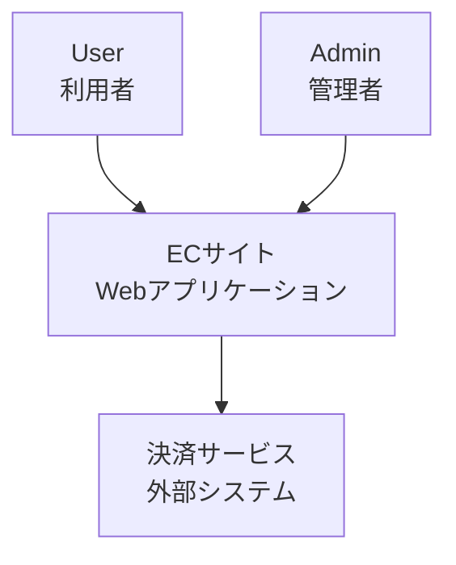
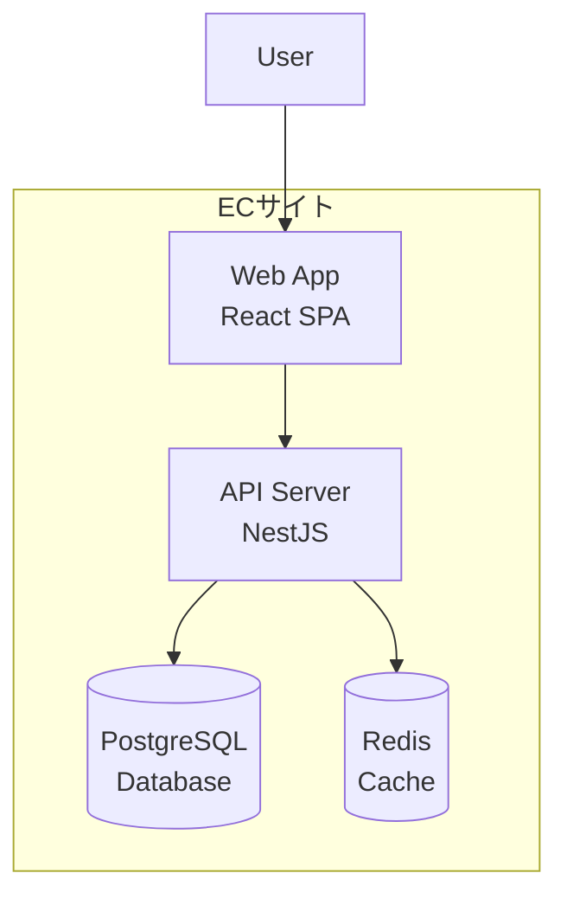
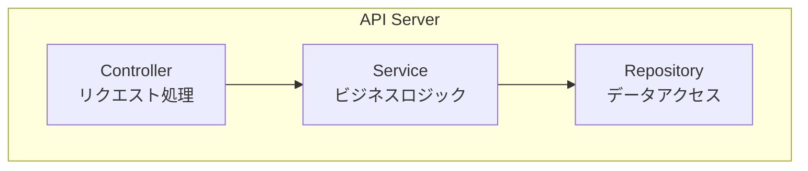

# c4-modeling

C4 Modelによるアーキテクチャ図法。

## 用途

システムアーキテクチャを4つの抽象レベルで可視化する。

## 使用Agent

- Architect (AppArchitect)

## 知識・手法

### 4つのレベル

1. **Context (L1)** - システム全体と外部アクター
2. **Container (L2)** - アプリケーション・データストア
3. **Component (L3)** - 主要コンポーネント
4. **Code (L4)** - クラス図（必要な場合のみ）

### L1: System Context

### L2: Container

### L3: Component

## 記述ルール

1. **箱の色分け**
   - 青: 自システム
   - 灰: 外部システム
   - 緑: データストア

2. **矢印の方向**
   - 依存の向き（呼び出す側→呼び出される側）

3. **ラベル**
   - 名前 + 技術/役割

## 成果物

- `docs/03_アプリケーション設計/01_アーキテクチャ設計/c4-context.md`
- `docs/03_アプリケーション設計/01_アーキテクチャ設計/c4-container.md`
- `docs/03_アプリケーション設計/01_アーキテクチャ設計/c4-component.md`

## 参照

- [C4 Model公式](https://c4model.com/)
- [設計書テンプレート](../../../docs/30_templates/)
