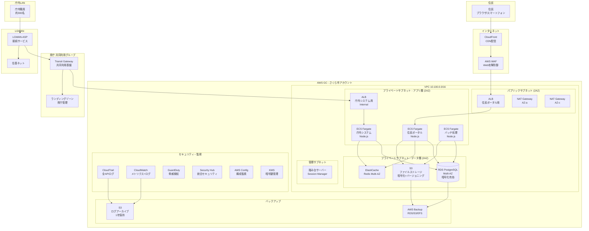
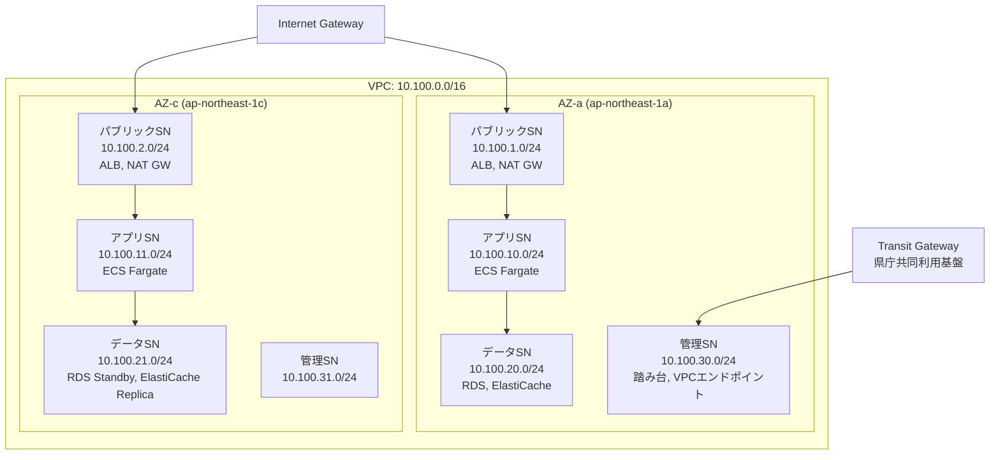
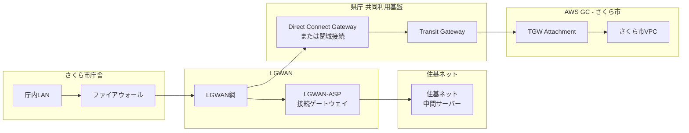
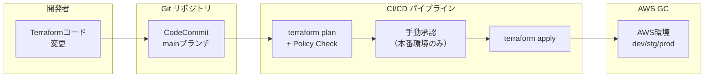
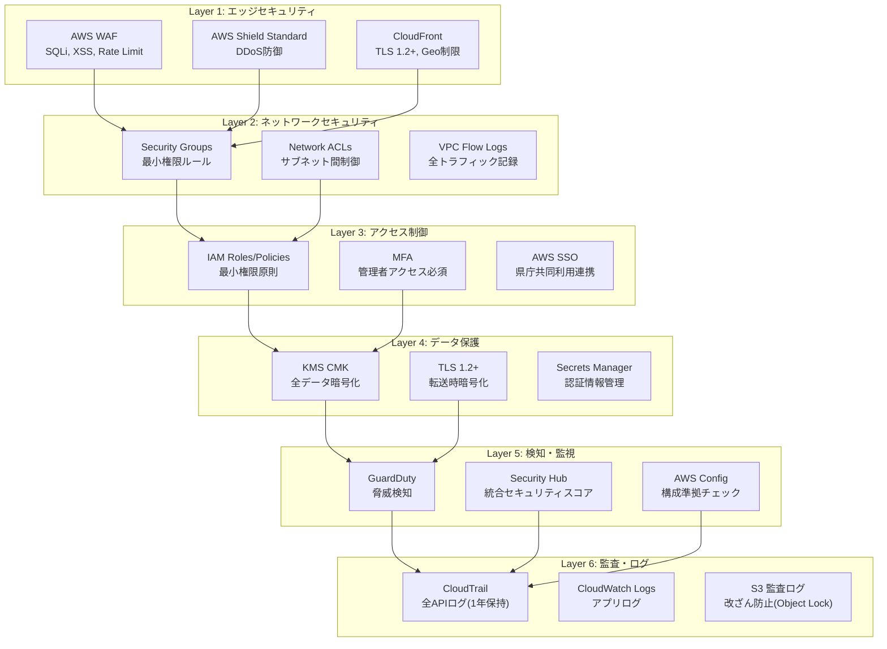

## 改訂履歴

| バージョン | 更新日 | 更新者 | 変更内容 | ステータス |
|-----------|--------|--------|--------|----------|
| 1.0 | 2026-04-06 | infra-proposal | 初版作成。RFP要求に基づく技術提案書全章を作成 | draft |

---

# さくら市マイナンバーサービス基盤移行プロジェクト

# 技術提案書

**提案先:** さくら市 総務部 情報政策課 御中

**提案企業:** 株式会社GCソリューションズ

**提案日:** 2026年4月6日

**有効期限:** 2026年6月5日（60日間）

**文書番号:** PRO-2026-SAKURA-001

**機密区分:** CONFIDENTIAL

---

## 目次

- [第1章 企業概要](#第1章-企業概要)
- [第2章 プロジェクト体制図](#第2章-プロジェクト体制図)
- [第3章 技術提案書](#第3章-技術提案書)
  - [3.1 GC対応実績](#31-gc対応実績)
  - [3.2 ISMAP対応方針](#32-ismap対応方針)
  - [3.3 提案アーキテクチャ](#33-提案アーキテクチャ)
  - [3.4 IaC選定根拠](#34-iac選定根拠)
  - [3.5 セキュリティ設計](#35-セキュリティ設計)
  - [3.6 リスク評価](#36-リスク評価)
- [第4章 スケジュール計画](#第4章-スケジュール計画)
- [第5章 見積内訳](#第5章-見積内訳)
- [第6章 品質保証体制](#第6章-品質保証体制)
- [付録](#付録)

---

# 第1章 企業概要

## 1.1 会社概要

| 項目 | 内容 |
|------|------|
| 会社名 | 株式会社GCソリューションズ |
| 設立 | 2010年4月1日 |
| 資本金 | 5億円 |
| 代表取締役 | 田中 太郎 |
| 本社所在地 | 東京都千代田区霞が関1-2-3 GCビル 10F |
| 従業員数 | 850名（2026年4月現在） |
| 売上高 | 120億円（2025年度） |
| 事業内容 | ガバメントクラウド設計・構築・運用支援、自治体DX推進支援、セキュリティコンサルティング |

## 1.2 認定資格・パートナーシップ

| 認定・資格 | 認定番号/状態 | 取得年月 |
|-----------|-------------|---------|
| ISMAP認定（クラウドサービス構築支援） | ISMAP-2024-GCS-001 | 2024年6月 |
| ISO 27001（情報セキュリティマネジメントシステム） | JP-ISMS-2023-0456 | 2023年3月 |
| ISO 27017（クラウドセキュリティ） | JP-CSMS-2023-0123 | 2023年6月 |
| AWS Advanced Tier Services Partner | - | 2022年4月 |
| AWS Public Sector Partner | - | 2023年1月 |
| プライバシーマーク | 第12345678号 | 2022年10月 |
| Terraform Certified Partner（HashiCorp） | - | 2024年2月 |

## 1.3 GC案件実績

当社は2022年以降、計18件のガバメントクラウド案件を手掛けており、マイナンバー関連システムの移行実績を有しています。

| No. | 案件名 | 規模 | 移行方式 | 期間 | 本稼働 | 特記事項 |
|-----|--------|------|--------|------|--------|---------|
| 1 | A県 住民情報システムGC移行 | 人口180万人 | R1 | 14ヶ月 | 2024年3月 | 共同利用（8市町村）、LGWAN接続、マイナンバー取扱い |
| 2 | B市 基幹業務システムGC移行 | 人口15万人 | R1 | 10ヶ月 | 2024年9月 | 単独利用、ECS Fargate採用、Terraform管理 |
| 3 | C市 福祉・税務システムGC移行 | 人口8万人 | リフト | 8ヶ月 | 2025年3月 | 共同利用、住基ネット連携 |
| 4 | D県 共同利用基盤構築 | 12市町村 | 新規構築 | 18ヶ月 | 2025年6月 | 共同利用基盤、IaC(Terraform)全面採用 |
| 5 | E市 マイナンバーカード関連システム移行 | 人口25万人 | R1 | 12ヶ月 | 2025年12月 | ISMAP対応、セキュリティ外部監査実施済み |

**マイナンバー取扱い実績:**
当社はマイナンバー法（番号利用法）に基づく特定個人情報の安全管理措置について深い知見を有しており、A県案件およびE市案件にてマイナンバー取扱いシステムのGC移行を完遂しています。

## 1.4 技術者保有資格

| 資格 | 保有者数 |
|------|---------|
| AWS Solutions Architect Professional | 42名 |
| AWS Security Specialty | 28名 |
| AWS Advanced Networking Specialty | 15名 |
| HashiCorp Terraform Associate | 55名 |
| 情報処理安全確保支援士（登録セキスペ） | 18名 |
| ネットワークスペシャリスト | 12名 |
| プロジェクトマネージャ | 22名 |

---

# 第2章 プロジェクト体制図

## 2.1 プロジェクト体制

```mermaid
graph TB
    subgraph さくら市
        SC[ステアリングコミッティ<br/>情報政策課長]
        PM_C[プロジェクトマネージャー<br/>（さくら市側）]
        U1[業務部門代表<br/>市民課・税務課・福祉課]
        U2[情報セキュリティ担当]
        U3[ネットワーク担当]
    end

    subgraph 株式会社GCソリューションズ
        PM[プロジェクトマネージャー<br/>佐藤 一郎（PMP/PM資格）<br/>GC案件15年]
        
        subgraph 設計・構築チーム
            AR[アーキテクト<br/>鈴木 花子<br/>AWS SAP/GC設計10年]
            IE1[インフラSE-1<br/>高橋 次郎<br/>AWS構築8年]
            IE2[インフラSE-2<br/>山田 三郎<br/>AWS構築6年]
            NE[ネットワークSE<br/>中村 四郎<br/>LGWAN設計12年]
        end

        subgraph セキュリティチーム
            SE_SEC[セキュリティSE<br/>小林 五郎<br/>ISMAP対応8年/登録セキスペ]
        end

        subgraph DB・移行チーム
            DE[データベースSE<br/>加藤 六郎<br/>PostgreSQL/RDS移行10年]
        end

        subgraph 品質管理チーム
            QA1[テストSE-1<br/>渡辺 七郎<br/>テスト設計7年]
            QA2[テストSE-2<br/>伊藤 八子<br/>テスト自動化5年]
        end
    end

    subgraph 協力会社
        EXT[セキュリティ診断<br/>（外部診断機関）]
    end

    SC --> PM_C
    PM_C --> U1
    PM_C --> U2
    PM_C --> U3
    PM_C <--> PM
    PM --> AR
    PM --> SE_SEC
    PM --> DE
    PM --> QA1
    AR --> IE1
    AR --> IE2
    AR --> NE
    QA1 --> QA2
    SE_SEC --> EXT
```

## 2.2 メンバー構成

| 役割 | 氏名 | 経験年数 | 保有資格 | 担当範囲 | 稼働率 |
|------|------|---------|---------|---------|-------|
| プロジェクトマネージャー | 佐藤 一郎 | 15年 | PMP, IPA-PM, AWS SAP | 全体統括、スケジュール・予算管理、顧客折衝 | 100% |
| アーキテクト | 鈴木 花子 | 10年 | AWS SAP, AWS Security, Terraform Associate | アーキテクチャ設計、IaC設計、技術方針策定 | 100% |
| インフラSE-1 | 高橋 次郎 | 8年 | AWS SAA, Terraform Associate | AWS環境構築、ECS/ALB/CloudFront設定 | 100% |
| インフラSE-2 | 山田 三郎 | 6年 | AWS SAA, AWS DVA | IaC開発（Terraform）、CI/CDパイプライン構築 | 80% |
| ネットワークSE | 中村 四郎 | 12年 | ネットワークスペシャリスト, AWS ANS | VPC設計、LGWAN接続設計、DirectConnect | 80% |
| セキュリティSE | 小林 五郎 | 8年 | 登録セキスペ, AWS Security Specialty, CISSP | セキュリティ設計、ISMAP対応、監査対応 | 80% |
| データベースSE | 加藤 六郎 | 10年 | AWS Database Specialty, PostgreSQL認定 | RDS設計、データ移行、バックアップ・DR設計 | 60% |
| テストSE-1 | 渡辺 七郎 | 7年 | JSTQB Advanced | テスト計画・設計、品質管理 | 80% |
| テストSE-2 | 伊藤 八子 | 5年 | JSTQB Foundation, AWS SAA | テスト実行、テスト自動化 | 80% |

**合計:** 9名体制（フルタイム換算: 7.6名）

## 2.3 フェーズ別稼働計画

| フェーズ | 期間 | PM | AR | IE1 | IE2 | NE | Sec | DE | QA1 | QA2 | 合計 |
|---------|------|----|----|-----|-----|----|-----|----|-----|-----|------|
| Phase 0 GCAS申請 | 2W | 1.0 | 0.5 | - | - | - | 0.5 | - | - | - | 2.0 |
| Phase 1 提案・見積 | 2W | 1.0 | 1.0 | 0.5 | - | 0.5 | 0.5 | 0.5 | - | - | 4.0 |
| Phase 2 要件定義 | 6W | 1.0 | 1.0 | 0.5 | - | 0.8 | 0.8 | 0.5 | 0.3 | - | 4.9 |
| Phase 3 詳細見積 | 2W | 1.0 | 1.0 | 0.5 | 0.5 | 0.5 | 0.5 | 0.5 | - | - | 4.5 |
| Phase 4 詳細設計 | 8W | 1.0 | 1.0 | 1.0 | 0.8 | 0.8 | 0.8 | 0.6 | 0.5 | - | 6.5 |
| Phase 5 構築・IaC | 8W | 1.0 | 0.8 | 1.0 | 1.0 | 0.8 | 0.5 | 0.8 | 0.5 | 0.5 | 6.9 |
| Phase 6 テスト | 8W | 1.0 | 0.5 | 0.8 | 0.8 | 0.5 | 0.8 | 0.5 | 1.0 | 1.0 | 6.9 |
| Phase 7 移行・本稼働 | 4W | 1.0 | 0.8 | 1.0 | 0.5 | 0.8 | 0.5 | 1.0 | 0.5 | 0.5 | 6.6 |

## 2.4 顧客側ご協力事項

本プロジェクトの成功のため、さくら市側に以下のリソース配置をお願いいたします。

| 役割 | 必要人数 | 稼働率 | 期間 | 主な役割 |
|------|---------|-------|------|---------|
| プロジェクトマネージャー | 1名 | 専任推奨 | 全期間 | 意思決定、庁内調整、ステアリング運営 |
| 業務部門代表 | 3名 | 週8時間 | Phase 2-7 | ヒアリング対応、要件確認、受入テスト |
| 情報セキュリティ担当 | 1名 | 週4時間 | Phase 2-6 | セキュリティ要件確認、監査対応支援 |
| ネットワーク担当 | 1名 | 週4時間 | Phase 2-5 | LGWAN接続、庁内NW調整 |

---

# 第3章 技術提案書

## 3.1 GC対応実績

### 3.1.1 当社のガバメントクラウド知見

当社は2022年のガバメントクラウド制度開始当初から、デジタル庁との連携のもとGC設計・構築支援を行っており、以下の知見を蓄積しています。

**GCAS（ガバメントクラウド補助システム）対応:**
- CEP（契約企業プロフィール）登録済み（登録番号: GC-CEP-2022-XXX）
- GCAS申請手続きの標準化（申請から承認まで平均2.5週間）
- GCASテンプレート（自動適用テンプレート・必須適用テンプレート）の適用実績18件

**共同利用グループへの参加実績:**
- A県共同利用グループ（8市町村）への参加支援実績あり
- 共同利用時のアカウント分離、コスト按分、ガバナンス設計の知見
- 県庁のランディングゾーン（LZ）への準拠経験

### 3.1.2 本案件との類似実績

**最も類似する案件: E市マイナンバーカード関連システム移行**

| 比較項目 | E市案件 | 本案件（さくら市） |
|---------|--------|-----------------|
| 人口規模 | 25万人 | 12万人 |
| 移行方式 | R1（リホスト+一部PaaS化） | R1（リホスト+一部リプラットフォーム） |
| 現行環境 | オンプレミス（Java + PostgreSQL） | Heroku（Node.js + PostgreSQL） |
| GC利用方式 | 単独利用 | 共同利用 |
| ISMAP対応 | 必須（マイナンバー） | 必須（マイナンバー） |
| LGWAN接続 | あり（住基ネット連携） | あり（住基ネット連携） |
| 主要AWSサービス | ECS Fargate, RDS, ElastiCache | ECS Fargate, RDS, ElastiCache |

E市案件で培った「マイナンバー取扱いシステム特有のセキュリティ設計」「LGWAN-ASP接続サービス経由の住基ネット連携設計」のノウハウを本案件に活用いたします。

### 3.1.3 Herokuからの移行知見

当社は民間企業向けを含め、Herokuから AWS への移行を5件実施しています。Heroku特有の以下の点について十分な知見があります。

| Herokuコンポーネント | AWS移行先 | 移行時の留意点 |
|---------------------|----------|--------------|
| Heroku Dyno (Web/Worker) | ECS Fargate | Procfile → ECSタスク定義への変換、12-Factor App対応確認 |
| Heroku PostgreSQL | RDS for PostgreSQL | pg_dump/pg_restore による移行、拡張機能互換性確認 |
| Heroku Redis | ElastiCache for Redis | セッション管理の接続先変更、フェイルオーバー設定 |
| Heroku Config Vars | AWS Systems Manager Parameter Store / Secrets Manager | 環境変数の移行、暗号化管理 |
| Cloudflare CDN | CloudFront + AWS WAF | DNS切替、WAFルール設計、キャッシュ戦略移行 |
| Heroku Add-ons | 各種AWSマネージドサービス | ログ管理、監視、メール配信等の代替サービス選定 |

## 3.2 ISMAP対応方針

### 3.2.1 ISMAP対応の全体方針

本案件はマイナンバー（特定個人情報）を取り扱うシステムであり、ISMAP（情報セキュリティマネジメント適格性認定）への完全準拠が必要です。

**対応方針の3つの柱:**

1. **ISMAP認定サービスのみの使用** -- AWS GCはISMAP認定済みクラウドサービスであり、本提案で使用するすべてのAWSサービスがISMAP認定の範囲内であることを確認済みです。
2. **ISMAP管理基準305統制項目への準拠** -- 設計・構築・運用の全フェーズにおいて、ISMAP管理基準の305統制項目に基づいたセキュリティ対策を実装します。
3. **継続的なセキュリティ監視** -- 本稼働後も、GuardDuty、Security Hub、AWS Configによる継続的な監視と、定期的なセキュリティ監査を実施します。

### 3.2.2 ISMAP統制項目への対応マッピング

| ISMAP統制カテゴリ | 統制項目数 | 対応方法 | 実装サービス |
|-----------------|----------|---------|------------|
| アクセス制御 | 32項目 | IAMロールベース制御、MFA強制、最小権限原則 | IAM, AWS SSO, MFA |
| 暗号化 | 18項目 | 保存時暗号化（AES-256）、転送時暗号化（TLS 1.2+） | KMS, ACM, ALB |
| ネットワークセキュリティ | 24項目 | VPCセグメンテーション、SG/NACL、WAF | VPC, WAF, Shield |
| ログ管理・監査 | 28項目 | 全APIログ記録、1年以上保持、改ざん防止 | CloudTrail, CloudWatch Logs, S3 |
| 構成管理 | 15項目 | AWS Config による構成監視、自動修復 | AWS Config, Systems Manager |
| インシデント対応 | 20項目 | GuardDuty脅威検知、Security Hubスコアリング | GuardDuty, Security Hub |
| 事業継続 | 12項目 | Multi-AZ冗長構成、AWS Backupによるバックアップ | RDS Multi-AZ, AWS Backup |
| 物理セキュリティ | 8項目 | AWS GCデータセンター（東京リージョン）で対応済み | AWS責任共有モデル |

### 3.2.3 マイナンバー法対応

**特定個人情報の安全管理措置:**

| 措置区分 | 対応内容 |
|---------|---------|
| 組織的安全管理措置 | アクセス権限の管理体制、ログ監査体制の整備 |
| 人的安全管理措置 | 運用者のセキュリティ教育、秘密保持契約 |
| 物理的安全管理措置 | AWS GCデータセンターの物理セキュリティ（ISMAP認定済み） |
| 技術的安全管理措置 | アクセス制御、暗号化、ログ取得・監視、不正検知 |

**特定個人情報ファイルの取扱い:**
- データベース内のマイナンバー関連データはKMSカスタマーマネージドキー（CMK）で暗号化
- マイナンバーへのアクセスはCloudTrailで全件記録
- マイナンバー検索・参照のログはCloudWatch Logsで1年以上保持
- 特定個人情報保護評価書（PIA）の作成支援

## 3.3 提案アーキテクチャ

### 3.3.1 アーキテクチャ全体図



### 3.3.2 アーキテクチャ設計方針

**設計原則:**

| 原則 | 内容 | 実装方法 |
|------|------|---------|
| セキュリティ最優先 | マイナンバーを扱うシステムとして、ISMAP準拠のセキュリティを全レイヤーで実装 | KMS暗号化、IAM最小権限、WAF、GuardDuty |
| 高可用性 | 住民サービスの継続性を担保するMulti-AZ構成 | RDS Multi-AZ、ECS Fargate(2AZ)、ALB |
| 運用効率化 | マネージドサービスの活用により運用負荷を低減 | ECS Fargate（サーバーレスコンテナ）、RDS、ElastiCache |
| コスト最適化 | 予算内での最適なリソース配置 | Fargate Spot(バッチ)、RDS RI、S3ライフサイクル |
| 再現性・可監査性 | IaCによるインフラのコード化、全変更の追跡 | Terraform、CloudTrail、AWS Config |

### 3.3.3 コンポーネント別設計

#### (1) コンピュート: ECS Fargate

| 項目 | 住民ポータル | 庁内システム | バッチ処理 |
|------|------------|------------|----------|
| サービスタイプ | ECS Fargate Service | ECS Fargate Service | ECS Fargate Task (Scheduled) |
| タスク数 | 2-8（Auto Scaling） | 2-4（Auto Scaling） | 1-2（バッチ実行時） |
| vCPU / メモリ | 1 vCPU / 2GB | 1 vCPU / 2GB | 2 vCPU / 4GB |
| Auto Scaling | CPU 70%、リクエスト数ベース | CPU 70% | - |
| デプロイ方式 | Blue/Greenデプロイ | Blue/Greenデプロイ | ローリング |
| ヘルスチェック | ALBヘルスチェック（/health） | ALBヘルスチェック | タスク終了ステータス |
| コンテナイメージ | ECR（脆弱性スキャン有効） | ECR | ECR |

**Herokuからの移行ポイント:**
- Heroku DynoのProcfile定義をECSタスク定義に変換
- Heroku Config VarsをAWS Systems Manager Parameter StoreおよびSecrets Managerに移行
- 12-Factor Appの原則に基づくコンテナ設計（環境変数による設定注入）
- Heroku Scheduler相当の機能をEventBridge + ECS Scheduled Taskで実現

#### (2) データベース: RDS for PostgreSQL

| 項目 | 設定値 |
|------|-------|
| エンジン | PostgreSQL 15.x（Heroku PostgreSQL互換バージョン） |
| インスタンスクラス | db.r6g.large（本番）/ db.t3.medium（開発） |
| ストレージ | gp3, 200GB（自動拡張有効、最大1TB） |
| Multi-AZ | 有効 |
| 暗号化 | KMS CMK（AES-256） |
| バックアップ | 自動バックアップ（保持期間35日）+ AWS Backup |
| パラメータグループ | カスタム（Heroku PostgreSQL互換設定） |
| 拡張機能 | pgcrypto, uuid-ossp, pg_stat_statements |
| パフォーマンスインサイト | 有効（7日間保持） |

**PostgreSQL移行の留意点:**
- Heroku PostgreSQLのバージョンとRDS for PostgreSQLのバージョン互換性を確認
- Heroku固有の拡張機能（heroku_ext等）の代替対応
- 接続プーリング（Heroku PgBouncer → RDS Proxy）の適用検討

#### (3) キャッシュ: ElastiCache for Redis

| 項目 | 設定値 |
|------|-------|
| エンジン | Redis 7.x |
| ノードタイプ | cache.r6g.large |
| レプリカ | 1（Multi-AZ自動フェイルオーバー） |
| 暗号化（転送時） | TLS有効 |
| 暗号化（保存時） | KMS CMK |
| パラメータグループ | カスタム（maxmemory-policy: allkeys-lru） |

#### (4) ストレージ: S3

| バケット | 用途 | 暗号化 | バージョニング | ライフサイクル |
|---------|------|-------|-------------|-------------|
| sakura-app-data | アプリケーションファイル | SSE-KMS | 有効 | 90日後IA、365日後Glacier |
| sakura-audit-logs | 監査ログ保管 | SSE-KMS | 有効 | 365日保持（削除不可） |
| sakura-backup | バックアップ保管 | SSE-KMS | 有効 | 90日後Glacier |
| sakura-static-assets | 静的コンテンツ（CloudFront配信） | SSE-S3 | 有効 | - |

#### (5) ネットワーク: VPC設計



**サブネット設計:**

| サブネット名 | CIDRブロック | AZ | 用途 | ルートテーブル |
|------------|------------|-----|------|-------------|
| public-a | 10.100.1.0/24 | AZ-a | ALB(外部)、NAT Gateway | 0.0.0.0/0 → IGW |
| public-c | 10.100.2.0/24 | AZ-c | ALB(外部)、NAT Gateway | 0.0.0.0/0 → IGW |
| app-a | 10.100.10.0/24 | AZ-a | ECS Fargate タスク | 0.0.0.0/0 → NAT GW(a) |
| app-c | 10.100.11.0/24 | AZ-c | ECS Fargate タスク | 0.0.0.0/0 → NAT GW(c) |
| data-a | 10.100.20.0/24 | AZ-a | RDS Primary、ElastiCache | ルーティングなし（VPC内通信のみ） |
| data-c | 10.100.21.0/24 | AZ-c | RDS Standby、ElastiCache Replica | ルーティングなし |
| mgmt-a | 10.100.30.0/24 | AZ-a | 踏み台、VPCエンドポイント | TGW経由で県庁NW接続 |
| mgmt-c | 10.100.31.0/24 | AZ-c | 管理系予備 | TGW経由で県庁NW接続 |

**VPCエンドポイント:**

| エンドポイント | タイプ | 用途 |
|-------------|------|------|
| com.amazonaws.ap-northeast-1.s3 | Gateway | S3へのプライベートアクセス |
| com.amazonaws.ap-northeast-1.ecr.dkr | Interface | ECRイメージ取得 |
| com.amazonaws.ap-northeast-1.ecr.api | Interface | ECR API |
| com.amazonaws.ap-northeast-1.logs | Interface | CloudWatch Logsへの送信 |
| com.amazonaws.ap-northeast-1.ssm | Interface | Systems Manager |
| com.amazonaws.ap-northeast-1.kms | Interface | KMS鍵操作 |
| com.amazonaws.ap-northeast-1.secretsmanager | Interface | Secrets Manager |

#### (6) CDN・WAF: CloudFront + AWS WAF

| 項目 | 設定値 |
|------|-------|
| オリジン | ALB（住民ポータル用） |
| SSL証明書 | ACM（AWS Certificate Manager）発行 |
| 最低TLSバージョン | TLS 1.2 |
| キャッシュポリシー | 静的コンテンツ（24時間）、動的コンテンツ（キャッシュなし） |
| WAFルール | AWSマネージドルール（Core、Known Bad Inputs、SQL Injection、Linux OS） |
| カスタムWAFルール | レート制限（1000 req/5min/IP）、地理的制限（日本のみ） |
| ログ | S3へのアクセスログ出力 |

#### (7) LGWAN接続設計



**LGWAN接続方式:**

| 項目 | 設計内容 |
|------|---------|
| 接続方式 | 県庁共同利用グループのTransit Gatewayを経由 |
| 帯域 | 100Mbps（初期）、必要に応じて増速可能 |
| 冗長化 | Transit Gateway Attachment 2本（AZ冗長） |
| ルーティング | 庁内LAN(10.x.x.x) ↔ AWS VPC(10.100.x.x) のスタティックルート |
| アクセス制御 | Security Group + NACL で庁内LAN CIDRからのみ許可 |
| 住基ネット連携 | LGWAN-ASP接続サービス経由（既存接続を継続利用） |

### 3.3.4 Herokuからの移行マッピング

| 現行（Heroku） | 移行先（AWS GC） | 移行方法 |
|---------------|----------------|---------|
| Heroku Web Dyno (Node.js) | ECS Fargate (住民ポータル) | Dockerコンテナ化、ECSタスク定義作成 |
| Heroku Worker Dyno | ECS Fargate (バッチ処理) | Scheduled Task化 |
| Heroku PostgreSQL | RDS for PostgreSQL (Multi-AZ) | pg_dump → pg_restore（DMS併用） |
| Heroku Redis | ElastiCache for Redis (Multi-AZ) | redis-cli + RDB dump による移行 |
| AWS S3 (Heroku経由) | S3 (GCアカウント内) | S3 Cross-Account Copy |
| Cloudflare CDN | CloudFront + AWS WAF | DNS切替、WAFルール再設計 |
| Heroku Logging (Logplex) | CloudWatch Logs + S3 | ログドライバー変更 |
| Heroku Scheduler | EventBridge + ECS Scheduled Task | スケジュール定義の移行 |
| Heroku Config Vars | SSM Parameter Store / Secrets Manager | 環境変数の移行・暗号化 |
| Heroku Review Apps | CodePipeline + ECS(dev) | CI/CDパイプライン構築 |

## 3.4 IaC選定根拠

### 3.4.1 Terraform採用の根拠

本案件ではIaC（Infrastructure as Code）ツールとして**Terraform**を採用します。

**選定理由:**

| 評価項目 | Terraform | CloudFormation | CDK | 選定理由 |
|---------|-----------|---------------|-----|---------|
| GC標準モジュール対応 | ○ | ○ | △ | デジタル庁提供のGC標準Terraformモジュールに対応 |
| マルチクラウド対応 | ○ | × | △ | 将来的なマルチクラウド対応の柔軟性 |
| 状態管理 | ○ (S3 + DynamoDB) | ○ (自動) | ○ (自動) | S3バックエンドによる明示的な状態管理 |
| ドリフト検出 | ○ (terraform plan) | ○ | ○ | plan段階で変更差分を可視化 |
| 再現性・可読性 | ○ (HCL) | △ (JSON/YAML冗長) | △ (プログラミング知識必要) | HCLの宣言的記法は可読性が高い |
| コミュニティ | ○ (非常に大きい) | ○ | △ | 豊富なモジュール、ベストプラクティス |
| 当社実績 | 18件のGC案件で使用 | 3件 | 2件 | 最も習熟度が高い |

### 3.4.2 Terraformディレクトリ構造

```
terraform/
├── environments/
│   ├── dev/
│   │   ├── main.tf
│   │   ├── variables.tf
│   │   ├── outputs.tf
│   │   ├── terraform.tfvars
│   │   └── backend.tf
│   ├── stg/
│   │   ├── main.tf
│   │   ├── variables.tf
│   │   ├── outputs.tf
│   │   ├── terraform.tfvars
│   │   └── backend.tf
│   └── prod/
│       ├── main.tf
│       ├── variables.tf
│       ├── outputs.tf
│       ├── terraform.tfvars
│       └── backend.tf
├── modules/
│   ├── vpc/
│   │   ├── main.tf
│   │   ├── variables.tf
│   │   ├── outputs.tf
│   │   └── README.md
│   ├── ecs/
│   │   ├── main.tf
│   │   ├── variables.tf
│   │   └── outputs.tf
│   ├── rds/
│   │   ├── main.tf
│   │   ├── variables.tf
│   │   └── outputs.tf
│   ├── elasticache/
│   │   ├── main.tf
│   │   ├── variables.tf
│   │   └── outputs.tf
│   ├── security/
│   │   ├── iam.tf
│   │   ├── kms.tf
│   │   ├── waf.tf
│   │   ├── guardduty.tf
│   │   ├── securityhub.tf
│   │   └── variables.tf
│   ├── monitoring/
│   │   ├── cloudwatch.tf
│   │   ├── cloudtrail.tf
│   │   └── variables.tf
│   ├── backup/
│   │   ├── main.tf
│   │   └── variables.tf
│   └── networking/
│       ├── cloudfront.tf
│       ├── alb.tf
│       └── variables.tf
├── policies/
│   ├── sentinel/          # Policy as Code
│   │   ├── enforce-encryption.sentinel
│   │   ├── enforce-tagging.sentinel
│   │   └── restrict-public-access.sentinel
│   └── opa/               # OPA ポリシー（代替）
│       ├── deny-public-s3.rego
│       └── require-encryption.rego
└── scripts/
    ├── init.sh
    └── plan-and-apply.sh
```

### 3.4.3 IaCコード例

**VPCモジュール（抜粋）:**

```terraform
# modules/vpc/main.tf

resource "aws_vpc" "main" {
  cidr_block           = var.vpc_cidr
  enable_dns_hostnames = true
  enable_dns_support   = true

  tags = merge(var.common_tags, {
    Name = "${var.project_name}-vpc"
  })
}

resource "aws_subnet" "public" {
  for_each = var.public_subnets

  vpc_id            = aws_vpc.main.id
  cidr_block        = each.value.cidr
  availability_zone = each.value.az

  tags = merge(var.common_tags, {
    Name = "${var.project_name}-public-${each.key}"
    Tier = "public"
  })
}

resource "aws_subnet" "app" {
  for_each = var.app_subnets

  vpc_id            = aws_vpc.main.id
  cidr_block        = each.value.cidr
  availability_zone = each.value.az

  tags = merge(var.common_tags, {
    Name = "${var.project_name}-app-${each.key}"
    Tier = "application"
  })
}

resource "aws_subnet" "data" {
  for_each = var.data_subnets

  vpc_id            = aws_vpc.main.id
  cidr_block        = each.value.cidr
  availability_zone = each.value.az

  tags = merge(var.common_tags, {
    Name = "${var.project_name}-data-${each.key}"
    Tier = "data"
  })
}
```

**変数定義（抜粋）:**

```terraform
# modules/vpc/variables.tf

variable "project_name" {
  type        = string
  description = "プロジェクト名"
}

variable "vpc_cidr" {
  type        = string
  description = "VPCのCIDRブロック"
  default     = "10.100.0.0/16"

  validation {
    condition     = can(cidrhost(var.vpc_cidr, 0))
    error_message = "有効なCIDRブロックを指定してください。"
  }
}

variable "common_tags" {
  type        = map(string)
  description = "全リソースに適用する共通タグ"
  default = {
    Project     = "sakura-mynumber"
    Environment = "prod"
    ManagedBy   = "terraform"
    CostCenter  = "sakura-city"
  }
}
```

### 3.4.4 Policy as Code

セキュリティポリシーをコードとして管理し、IaCのデプロイ前にポリシー違反を自動検出します。

**Sentinel ポリシー例（暗号化強制）:**

```python
# policies/sentinel/enforce-encryption.sentinel

import "tfplan/v2" as tfplan

# RDS インスタンスの暗号化を強制
rds_encrypted = rule {
  all tfplan.resource_changes as _, rc {
    rc.type is "aws_db_instance" implies
      rc.change.after.storage_encrypted is true
  }
}

# S3 バケットの暗号化を強制
s3_encrypted = rule {
  all tfplan.resource_changes as _, rc {
    rc.type is "aws_s3_bucket" implies
      length(rc.change.after.server_side_encryption_configuration) > 0
  }
}

# EBS ボリュームの暗号化を強制
ebs_encrypted = rule {
  all tfplan.resource_changes as _, rc {
    rc.type is "aws_ebs_volume" implies
      rc.change.after.encrypted is true
  }
}

main = rule {
  rds_encrypted and s3_encrypted and ebs_encrypted
}
```

### 3.4.5 CI/CDパイプライン



| 環境 | デプロイ方式 | 承認 |
|------|------------|------|
| dev | プッシュ時自動デプロイ | 不要 |
| stg | mainマージ時自動デプロイ | 不要 |
| prod | mainマージ後、手動承認後デプロイ | PM + アーキテクト承認必須 |

## 3.5 セキュリティ設計

### 3.5.1 セキュリティレイヤー設計



### 3.5.2 IAM設計

**ロール設計:**

| ロール名 | 対象 | 権限範囲 | MFA | 条件 |
|---------|------|---------|-----|------|
| SakuraAdmin | さくら市管理者 | IAM以外の全サービス管理 | 必須 | 庁内IPアドレスからのみ |
| SakuraOperator | さくら市運用者 | CloudWatch参照、ECSタスク操作 | 必須 | 庁内IPアドレスからのみ |
| SakuraReadOnly | さくら市閲覧者 | 全サービス読取専用 | 推奨 | 庁内IPアドレスからのみ |
| ECSTaskRole | ECSタスク | RDS, ElastiCache, S3, KMS, SSM | - | ECSタスクからのみ |
| ECSExecutionRole | ECSエージェント | ECR取得, CloudWatch Logs書込 | - | ECSサービスからのみ |
| BackupRole | AWS Backup | RDSスナップショット, S3コピー | - | AWS Backupサービスからのみ |
| PrefectureSharedRole | 県庁共同利用 | Transit Gatewayアタッチメント参照 | - | 県庁アカウントからのみ |

**IAMポリシーの原則:**
- 全ロールにIPアドレス制限条件を付与（管理者系）
- ワイルドカード（`*`）の使用禁止（リソースARNを明示）
- 定期的なIAM Access Analyzerによる権限棚卸し（四半期）
- 未使用ロール・ポリシーの自動検出・削除

### 3.5.3 暗号化設計

| 対象 | 暗号化方式 | 鍵管理 | 鍵ローテーション |
|------|----------|--------|---------------|
| RDS for PostgreSQL | AES-256 (SSE) | KMS CMK (sakura-rds-key) | 年1回自動 |
| ElastiCache for Redis | AES-256 (保存時) + TLS (転送時) | KMS CMK (sakura-cache-key) | 年1回自動 |
| S3 バケット | SSE-KMS (AES-256) | KMS CMK (sakura-s3-key) | 年1回自動 |
| EBS ボリューム | AES-256 | KMS CMK (sakura-ebs-key) | 年1回自動 |
| CloudTrail ログ | SSE-KMS | KMS CMK (sakura-log-key) | 年1回自動 |
| ALB ↔ ECS | TLS 1.2 | ACM証明書 | 自動更新 |
| CloudFront ↔ クライアント | TLS 1.2+ | ACM証明書 | 自動更新 |
| Secrets Manager | AES-256 | KMS CMK (sakura-secrets-key) | 30日自動 |

**KMS鍵ポリシー:**
- 鍵の作成・削除: SakuraAdminロールのみ
- 鍵の使用（暗号化/復号化）: ECSTaskRole, BackupRoleのみ
- 鍵のローテーション: 自動（年1回）
- 鍵の削除待機期間: 30日（誤削除防止）

### 3.5.4 監査ログ設計

| ログ種別 | サービス | 保持期間 | 保管先 | 改ざん防止 |
|---------|--------|---------|--------|----------|
| AWS APIコールログ | CloudTrail | 1年（S3）+ 90日（CloudWatch） | S3 (sakura-audit-logs) | Object Lock (Governance Mode) |
| VPCフローログ | VPC Flow Logs | 90日 | CloudWatch Logs → S3 | S3バケットポリシー |
| ALBアクセスログ | ALB | 90日 | S3 | S3バケットポリシー |
| WAFログ | AWS WAF | 90日 | CloudWatch Logs → S3 | S3バケットポリシー |
| アプリケーションログ | CloudWatch Logs | 90日（CloudWatch）+ 1年（S3） | CloudWatch Logs → S3 | Object Lock |
| RDS監査ログ | RDS(pgaudit) | 90日 | CloudWatch Logs → S3 | S3バケットポリシー |
| GuardDuty検知結果 | GuardDuty | 無期限 | Security Hub | - |

### 3.5.5 セキュリティ監視・検知

| 監視項目 | サービス | 検知条件 | アクション |
|---------|--------|---------|----------|
| 不正アクセス試行 | GuardDuty | ブルートフォース検知 | SNS通知 → 担当者メール |
| マルウェア検知 | GuardDuty | EC2/ECSマルウェアスキャン | SNS通知 + 自動隔離 |
| 構成変更違反 | AWS Config | 暗号化無効、パブリックアクセス許可 | 自動修復 (SSM Automation) |
| セキュリティスコア低下 | Security Hub | CISベンチマークスコア 80%未満 | SNS通知 |
| IAM異常行動 | IAM Access Analyzer | 外部アクセス検知 | SNS通知 → 即時調査 |
| ルートアカウントログイン | CloudTrail | ルートアカウント使用 | 即時SNS通知 → 緊急対応 |

## 3.6 リスク評価

### 3.6.1 リスク一覧と対策

#### 高リスク

| No. | リスク | 発生確率 | 影響度 | スケジュール影響 | 対策 | 残存リスク |
|-----|--------|---------|-------|---------------|------|----------|
| R-01 | Heroku→AWS移行時のアプリケーション互換性問題 | 中 | 高 | +2-4週間 | Phase 2でPoC（概念検証）を実施し、互換性を事前検証。Heroku固有依存の洗い出しをPhase 2で完了させる | 低 |
| R-02 | 県庁共同利用グループの接続仕様遅延 | 中 | 高 | +3-4週間 | Phase 0で県庁担当者と早期協議開始。Transit Gateway接続仕様を Phase 1で確定。接続テスト環境を先行構築 | 中 |
| R-03 | LGWAN-ASP接続サービスの申請・承認遅延 | 低 | 高 | +2-4週間 | Phase 1でLGWAN-ASP接続申請を開始。県庁LGWAN担当との定期連絡会（隔週）を実施 | 低 |
| R-04 | マイナンバーデータ移行時のセキュリティインシデント | 低 | 最高 | プロジェクト停止 | 暗号化通信（TLS 1.2+）でのデータ転送。移行リハーサルを2回実施。移行時はセキュリティSE立会い必須 | 低 |

#### 中リスク

| No. | リスク | 発生確率 | 影響度 | スケジュール影響 | 対策 | 残存リスク |
|-----|--------|---------|-------|---------------|------|----------|
| R-05 | PostgreSQLバージョン差異による移行エラー | 中 | 中 | +1-2週間 | Phase 2でHeroku PostgreSQLの詳細バージョン・拡張機能を調査。RDSとの互換性マトリクスを作成 | 低 |
| R-06 | セキュリティ監査での指摘多発 | 中 | 中 | +2-3週間 | Phase 4の設計段階でセキュリティレビューを実施。外部診断を Phase 5（構築中）に前倒し実施 | 低 |
| R-07 | さくら市側リソース確保の遅延 | 中 | 中 | +2週間 | 契約時にさくら市PM専任のコミットメントを確保。ヒアリング日程を Phase 2開始前に確定 | 低 |
| R-08 | ECS Fargate上でのNode.jsアプリケーション性能劣化 | 低 | 中 | +1-2週間 | Phase 5で性能テスト（JMeter）を実施。vCPU/メモリのサイジングをテスト結果に基づいて調整 | 低 |

#### 低リスク

| No. | リスク | 発生確率 | 影響度 | 対策 |
|-----|--------|---------|-------|------|
| R-09 | AWS GCの新サービス追加による設計見直し | 低 | 低 | 定期的な技術情報収集。設計レビュー時に新サービスの適用可能性を確認 |
| R-10 | Terraform バージョンアップに伴う互換性問題 | 低 | 低 | Terraformバージョンを固定（required_version制約）。バージョンアップは検証環境で事前テスト |

### 3.6.2 リスク軽減のための追加施策

**PoC（概念検証）の実施（Phase 2）:**

Herokuから AWS ECS Fargateへの移行における技術的リスクを早期に解消するため、Phase 2で以下のPoCを実施します。

| PoC項目 | 目的 | 期間 | 判定基準 |
|---------|------|------|---------|
| Node.jsアプリのコンテナ化 | Heroku Dyno → ECS Fargate移行の実現性検証 | 1週間 | 全APIエンドポイントが正常動作 |
| PostgreSQL移行テスト | Heroku PostgreSQL → RDS移行の互換性検証 | 1週間 | データ整合性100%、拡張機能動作 |
| Redis移行テスト | Heroku Redis → ElastiCache移行の検証 | 3日 | セッション引継ぎ正常動作 |
| LGWAN疎通テスト | 県庁TGW経由の通信検証 | 1週間 | ping疎通、HTTP通信成功 |

---

# 第4章 スケジュール計画

## 4.1 全体スケジュール

**プロジェクト期間:** 2026年5月 - 2027年3月（11ヶ月）

**本稼働予定日:** 2027年3月31日

| フェーズ | 期間 | 開始 | 終了 | 主要マイルストーン | 成果物 |
|---------|------|------|------|-----------------|--------|
| Phase 0: GCAS申請・体制確立 | 2週間 | 2026/05/01 | 2026/05/14 | GCAS承認取得 | CEP登録、GCAS承認通知書 |
| Phase 1: 提案・見積 | 2週間 | 2026/05/15 | 2026/05/28 | 詳細見積確定 | 詳細見積書、WBS |
| Phase 2: 要件定義 | 6週間 | 2026/06/01 | 2026/07/10 | 要件定義書承認 | 要件定義書、PoC報告書 |
| Phase 3: 詳細見積・計画 | 2週間 | 2026/07/13 | 2026/07/24 | 詳細WBS承認 | 詳細WBS、リソース計画 |
| Phase 4: 詳細設計 | 8週間 | 2026/07/27 | 2026/09/18 | 設計レビュー完了 | 各種設計書、IaC設計書 |
| Phase 5: 構築・IaC開発 | 8週間 | 2026/09/21 | 2026/11/13 | 環境構築完了 | AWS環境、Terraformコード |
| Phase 6: テスト | 8週間 | 2026/11/16 | 2027/01/08 | テスト完了 | テスト報告書、脆弱性診断報告書 |
| Phase 7: 移行・本稼働 | 4週間 | 2027/01/11 | 2027/02/05 | 移行リハーサル完了 | 移行手順書、切替計画書 |
| 並行運用・本稼働 | 8週間 | 2027/02/08 | 2027/03/31 | **本稼働** | 運用マニュアル、引継ぎ文書 |

## 4.2 ガントチャート

```
2026年                                    2027年
 5月   6月   7月   8月   9月   10月  11月  12月  1月   2月   3月
|-----|-----|-----|-----|-----|-----|-----|-----|-----|-----|-----|
Phase 0 [==]
GCAS申請   |

Phase 1    [==]
提案見積      |

Phase 2       [============]
要件定義               PoC↑ |

Phase 3                     [==]
詳細見積計画                   |

Phase 4                        [================]
詳細設計                                  NW設計|SEC設計|IaC設計
                                          ↑     ↑     ↑

Phase 5                                          [================]
構築・IaC                                          環境構築|IaC適用
                                                   ↑       ↑

Phase 6                                                          [================]
テスト                                                            機能|性能|セキュリティ
                                                                  ↑    ↑    ↑

Phase 7                                                                          [====]
移行                                                                              リハ|本番
                                                                                  ↑   ↑

並行運用                                                                               [========]
                                                                                        ↑    本稼働↑
                                                                                             3/31

  ↑ = マイルストーン
```

## 4.3 フェーズ別詳細タスク

### Phase 0: GCAS申請・体制確立（2週間）

| タスクID | タスク名 | 担当 | 工数(人日) | 期間 |
|---------|---------|------|----------|------|
| 0.1 | CEP登録書類作成 | PM, Sec | 5 | 3日 |
| 0.2 | セキュリティチェックシート作成 | Sec | 3 | 2日 |
| 0.3 | GCAS申請提出 | PM | 1 | 1日 |
| 0.4 | GCAS審査対応（質問回答） | PM, Sec | 3 | 4日 |
| 0.5 | プロジェクト体制確立、キックオフ準備 | PM | 3 | 3日 |
| | **Phase 0 合計** | | **15** | **2週間** |

### Phase 2: 要件定義（6週間）

| タスクID | タスク名 | 担当 | 工数(人日) | 期間 |
|---------|---------|------|----------|------|
| 2.1 | 現行Heroku環境調査・ドキュメント整理 | AR, IE1 | 20 | 2週間 |
| 2.2 | 業務部門ヒアリング（市民課、税務課、福祉課） | PM, AR | 15 | 2週間 |
| 2.3 | 非機能要件定義（性能、可用性、セキュリティ） | AR, Sec | 15 | 1週間 |
| 2.4 | LGWAN接続要件確認（県庁・LGWAN担当） | NE | 10 | 2週間 |
| 2.5 | 共同利用グループ接続仕様確認 | NE, AR | 8 | 1週間 |
| 2.6 | PoC実施（Node.jsコンテナ化、DB移行テスト） | IE1, DE | 20 | 2週間 |
| 2.7 | 要件定義書作成・レビュー | PM, AR | 12 | 1週間 |
| | **Phase 2 合計** | | **100** | **6週間** |

### Phase 4: 詳細設計（8週間）

| タスクID | タスク名 | 担当 | 工数(人日) | 期間 |
|---------|---------|------|----------|------|
| 4.1 | ネットワーク設計（VPC、サブネット、TGW接続） | NE | 25 | 2週間 |
| 4.2 | LGWAN接続詳細設計 | NE | 15 | 1.5週間 |
| 4.3 | セキュリティ設計（IAM、KMS、WAF、監査ログ） | Sec | 30 | 3週間 |
| 4.4 | アプリケーション基盤設計（ECS、ALB、CloudFront） | AR, IE1 | 25 | 2週間 |
| 4.5 | データベース設計（RDS、ElastiCache） | DE | 15 | 1.5週間 |
| 4.6 | バックアップ・DR設計 | DE, IE1 | 10 | 1週間 |
| 4.7 | 監視・ログ設計（CloudWatch、CloudTrail） | IE1 | 15 | 1.5週間 |
| 4.8 | IaC設計（Terraformモジュール設計） | AR, IE2 | 20 | 2週間 |
| 4.9 | CI/CDパイプライン設計 | IE2 | 10 | 1週間 |
| 4.10 | 設計レビュー（内部＋顧客） | PM, AR | 10 | 1週間 |
| | **Phase 4 合計** | | **175** | **8週間** |

## 4.4 マイルストーン一覧

| No. | マイルストーン | 予定日 | 判定基準 | 承認者 |
|-----|-------------|--------|---------|--------|
| M1 | GCAS承認 | 2026/05/14 | GCASアカウント発行 | デジタル庁 |
| M2 | 要件定義書承認 | 2026/07/10 | さくら市レビュー完了、署名 | さくら市情報政策課長 |
| M3 | 詳細WBS承認 | 2026/07/24 | 工数・スケジュール合意 | さくら市PM |
| M4 | 設計レビュー完了 | 2026/09/18 | 全設計書のレビュー完了 | さくら市PM + セキュリティ担当 |
| M5 | 環境構築完了 | 2026/11/13 | AWS環境の全リソース構築完了 | アーキテクト |
| M6 | テスト完了 | 2027/01/08 | 全テスト合格、脆弱性診断完了 | PM + テストSE |
| M7 | 移行リハーサル完了 | 2027/02/05 | 移行手順の検証完了 | PM + さくら市PM |
| M8 | 本稼働 | 2027/03/31 | Go/No-Go判定合格 | さくら市情報政策課長 |

## 4.5 並行運用・切替計画

| 項目 | 内容 |
|------|------|
| 並行運用期間 | 2027年2月8日 - 2027年3月28日（7週間） |
| データ同期方式 | AWS DMS（継続的レプリケーション）でHeroku PostgreSQL → RDS を同期 |
| DNS切替 | CloudFront + Route 53 でDNS加重ルーティング（段階的切替） |
| 切替判定（Go/No-Go） | 2027年3月25日 ステアリングコミッティにて判定 |
| 切戻し計画 | 本稼働後2週間以内ならDNS切替でHerokuへ即時切戻し可能 |
| Heroku環境廃止 | 本稼働後1ヶ月間は維持、2027年4月末に廃止 |

---

# 第5章 見積内訳

## 5.1 見積サマリ

| 大分類 | 金額（税抜） |
|--------|-----------|
| 1. 人件費（設計・構築・テスト・移行） | 33,600,000円 |
| 2. 外部コスト | 4,500,000円 |
| **合計（税抜）** | **38,100,000円** |
| 消費税（10%） | 3,810,000円 |
| **合計（税込）** | **41,910,000円** |

## 5.2 人件費内訳

### フェーズ別工数・金額

| フェーズ | 工数(人日) | 期間 | 平均単価(万円/人日) | 金額(万円) |
|---------|----------|------|-----------------|----------|
| Phase 0: GCAS申請・体制確立 | 15 | 2週間 | 8.0 | 120 |
| Phase 1: 提案・見積 | 25 | 2週間 | 8.0 | 200 |
| Phase 2: 要件定義 | 100 | 6週間 | 8.0 | 800 |
| Phase 3: 詳細見積・計画 | 25 | 2週間 | 8.0 | 200 |
| Phase 4: 詳細設計 | 175 | 8週間 | 8.0 | 1,400 |
| Phase 5: 構築・IaC開発 | 165 | 8週間 | 7.5 | 1,238 |
| Phase 6: テスト | 150 | 8週間 | 7.0 | 1,050 |
| Phase 7: 移行・本稼働 | 65 | 4週間 | 8.0 | 520 |
| 並行運用支援 | 40 | 8週間 | 7.0 | 280 |
| PM・管理（全期間） | 55 | 11ヶ月 | 8.5 | 468 |
| 予備（リスクバッファ 10%） | - | - | - | 284 |
| **人件費合計** | **815** | **11ヶ月** | - | **3,360** |

### ロール別単価

| ロール | 単価(万円/人日) | 根拠 |
|-------|--------------|------|
| プロジェクトマネージャー | 8.5 | PMP資格、GC案件15年経験 |
| アーキテクト | 8.5 | AWS SAP、GC設計10年経験 |
| インフラSE（シニア） | 8.0 | AWS構築8年経験 |
| インフラSE（ミドル） | 7.0 | AWS構築6年経験 |
| ネットワークSE | 8.0 | LGWAN設計12年経験 |
| セキュリティSE | 8.5 | ISMAP対応8年、登録セキスペ |
| データベースSE | 8.0 | PostgreSQL/RDS移行10年経験 |
| テストSE | 7.0 | JSTQB資格保有 |

## 5.3 外部コスト内訳

| 項目 | 金額(万円) | 摘要 |
|------|----------|------|
| AWS利用料（開発・検証環境、11ヶ月分） | 180 | dev/stg環境：月額約16万円 |
| セキュリティ診断（外部委託） | 150 | プラットフォーム診断+Webアプリ診断 各1回 |
| データ移行ツール（AWS DMS） | 20 | Heroku PostgreSQL → RDS移行用 |
| SSL証明書（ACM） | 0 | ACMは無料（AWS発行） |
| 教育・トレーニング | 50 | さくら市運用者向けAWS基礎研修(2日間) |
| ドキュメント作成・印刷 | 30 | 設計書・運用マニュアル印刷製本 |
| 出張・交通費 | 20 | さくら市訪問（ヒアリング、レビュー等） |
| **外部コスト合計** | **450** | |

## 5.4 AWS本番環境ランニングコスト（参考）

本稼働後の月額AWS利用料の概算です（本見積の対象外、参考情報として提示）。

| AWSサービス | スペック | 月額概算(万円) |
|------------|--------|-------------|
| ECS Fargate（住民ポータル） | 1vCPU/2GB x 4タスク | 8 |
| ECS Fargate（庁内システム） | 1vCPU/2GB x 2タスク | 4 |
| ECS Fargate（バッチ） | 2vCPU/4GB x 1タスク(日次) | 1 |
| RDS for PostgreSQL (Multi-AZ) | db.r6g.large | 12 |
| ElastiCache for Redis (Multi-AZ) | cache.r6g.large x 2ノード | 8 |
| ALB x 2（外部+内部） | - | 4 |
| NAT Gateway x 2 | - | 9 |
| CloudFront | - | 2 |
| AWS WAF | - | 1 |
| S3（データ+ログ） | 500GB想定 | 2 |
| CloudWatch, CloudTrail, Config等 | - | 3 |
| VPCエンドポイント | 7個 | 5 |
| AWS Backup | - | 2 |
| その他（Route 53, KMS等） | - | 1 |
| **月額合計** | | **約62万円** |
| **年額合計** | | **約744万円** |

**コスト最適化の余地:**
- ECS Fargate Spot（バッチ処理）: 最大70%削減
- RDS Reserved Instance（1年前払い）: 約30%削減
- ElastiCache Reserved Node: 約30%削減
- Savings Plans適用: 全体で15-25%削減可能

## 5.5 3点見積

| 見積種別 | 工数(人日) | 金額(税抜)(万円) | 条件 |
|---------|----------|---------------|------|
| 楽観見積 | 730 | 3,420 | 要件変更なし、PoC順調、リスク顕在化なし |
| **標準見積（本見積）** | **815** | **3,810** | **標準的な進行、一部リスク顕在化** |
| 悲観見積 | 950 | 4,450 | 要件変更あり、LGWAN接続遅延、セキュリティ指摘対応 |

## 5.6 支払条件（案）

| 支払時期 | 割合 | 金額(税込)(万円) | トリガー |
|---------|------|---------------|---------|
| 契約時 | 30% | 1,257 | 契約締結 |
| Phase 4完了時 | 30% | 1,257 | 設計レビュー完了・承認 |
| Phase 6完了時 | 20% | 838 | テスト完了報告 |
| 本稼働時 | 20% | 839 | 本稼働確認・検収 |
| **合計** | **100%** | **4,191** | |

**有効期限:** 本見積は2026年6月5日まで有効です。

---

# 第6章 品質保証体制

## 6.1 品質保証方針

本プロジェクトでは、IPA「共通フレーム2013」に準拠した品質保証プロセスを適用し、マイナンバー取扱いシステムとしての高品質を担保します。

**品質の3つの柱:**

| 柱 | 内容 | 実施方法 |
|-----|------|---------|
| プロセス品質 | 各フェーズの成果物品質をゲートレビューで担保 | フェーズゲート判定（M1-M8） |
| 成果物品質 | 設計書・IaCコードのレビュー体制 | ピアレビュー + 第三者レビュー |
| サービス品質 | 本稼働後のSLA達成 | 監視・アラート・定期レビュー |

## 6.2 テスト計画

### テスト種別と実施時期

| テスト種別 | 実施時期 | 担当 | 内容 | 合格基準 |
|-----------|---------|------|------|---------|
| 単体テスト（IaC） | Phase 5 | IE2 | Terraformモジュールの個別テスト | terraform plan成功率100% |
| 結合テスト | Phase 6 前半 | QA1, QA2 | コンポーネント間の連携テスト | 全テストケース合格 |
| 機能テスト | Phase 6 前半 | QA1, QA2 | 業務機能の正常動作確認 | 全業務シナリオ合格 |
| 性能テスト | Phase 6 中盤 | QA1, IE1 | 住民ポータル同時アクセステスト | レスポンスタイム 3秒以内（95%ile） |
| セキュリティテスト | Phase 6 後半 | Sec, 外部 | 脆弱性診断（プラットフォーム+Web） | 高リスク脆弱性ゼロ |
| 移行リハーサル | Phase 7 | DE, IE1 | データ移行の手順検証 | データ整合性100% |
| 受入テスト | Phase 7 | さくら市 | 業務部門による操作確認 | さくら市承認 |

### 性能テスト条件

| 項目 | 条件 |
|------|------|
| 同時接続数 | 500ユーザー（住民ポータル） |
| スループット | 100リクエスト/秒 |
| レスポンスタイム | 3秒以内（95パーセンタイル） |
| 持続時間 | 1時間 |
| ツール | Apache JMeter |
| 環境 | stg環境（本番同等スペック） |

### セキュリティテスト項目

| テスト項目 | 手法 | ツール | 基準 |
|-----------|------|--------|------|
| プラットフォーム脆弱性診断 | ネットワークスキャン | Nessus Professional | CVSSスコア7.0以上の脆弱性ゼロ |
| Webアプリケーション脆弱性診断 | DAST | OWASP ZAP + 手動診断 | OWASP Top 10対応済み |
| AWS構成診断 | CIS Benchmarkチェック | Prowler + Security Hub | CISベンチマークスコア90%以上 |
| IAM権限診断 | 最小権限チェック | IAM Access Analyzer | 過剰権限ゼロ |
| 暗号化診断 | 暗号化設定チェック | AWS Config Rules | 全データストアの暗号化有効 |

## 6.3 レビュー体制

| レビュー種別 | 頻度 | 参加者 | 内容 |
|------------|------|--------|------|
| デイリースクラム | 毎日 | GCソリューションズチーム | タスク進捗、課題共有 |
| 週次進捗会議 | 毎週金曜 | PM（両社）+ 主要メンバー | 週次進捗報告、課題対応方針 |
| 設計レビュー | Phase 4完了時 | 全メンバー + さくら市 | 設計書の技術レビュー |
| セキュリティレビュー | Phase 4, 6 | Sec + さくら市セキュリティ担当 | ISMAP準拠確認 |
| ステアリングコミッティ | 月1回 | さくら市課長 + PM | 予算・スケジュール・リスク報告 |
| フェーズゲート判定 | 各Phase完了時 | PM + さくら市PM | Go/No-Go判定 |

## 6.4 品質メトリクス

| メトリクス | 目標値 | 測定方法 | 報告頻度 |
|-----------|--------|---------|---------|
| スケジュール遵守率（SPI） | 0.95以上 | EVM（アーンドバリューマネジメント） | 月次 |
| コスト遵守率（CPI） | 0.95以上 | EVM | 月次 |
| テストケース合格率 | 100%（Phase 6完了時） | テスト管理ツール | 週次 |
| 障害密度（Phase 6） | 0.5件/KLOC以下 | 障害管理台帳 | 週次 |
| セキュリティスコア | 90%以上（Security Hub） | AWS Security Hub | 日次（自動） |
| IaCカバレッジ | 100%（全AWSリソース） | Terraform管理リソース/全リソース | Phase 5完了時 |

## 6.5 成果物一覧

| Phase | 成果物 | 形式 | 承認者 |
|-------|--------|------|--------|
| Phase 0 | CEP登録書類、GCAS承認通知書 | PDF | デジタル庁 |
| Phase 1 | 詳細見積書、WBS | Excel, PDF | さくら市PM |
| Phase 2 | 要件定義書、非機能要件定義書、PoC報告書 | Word, PDF | さくら市情報政策課長 |
| Phase 3 | 詳細WBS、リソース計画書 | Excel | さくら市PM |
| Phase 4 | ネットワーク設計書、セキュリティ設計書、アプリ基盤設計書、DB設計書、監視設計書、IaC設計書、バックアップ・DR設計書 | Word, PDF | さくら市PM + セキュリティ担当 |
| Phase 5 | 構築完了報告書、Terraformコード一式、CI/CDパイプライン設定書 | Word, Git | アーキテクト |
| Phase 6 | テスト計画書、テスト結果報告書、脆弱性診断報告書、性能テスト報告書 | Word, Excel, PDF | PM + さくら市PM |
| Phase 7 | 移行手順書、切替計画書、切戻し計画書、Go/No-Go判定書 | Word, PDF | さくら市情報政策課長 |
| 本稼働後 | 運用マニュアル、Runbook、監視設定書、引継ぎ文書 | Word, PDF | さくら市PM |

---

# 付録

## 付録A: 可用性設計（RTO/RPO）

| 項目 | 目標値 | 実現方法 |
|------|-------|---------|
| 可用性 | 99.95%（月間ダウンタイム22分以内） | Multi-AZ構成（ECS, RDS, ElastiCache） |
| RTO（目標復旧時間） | 30分以内 | Multi-AZフェイルオーバー自動化 |
| RPO（目標復旧ポイント） | 1時間以内 | RDS自動バックアップ（5分間隔）+ S3バージョニング |
| バックアップ保持期間 | 35日（RDS）、90日（S3） | AWS Backupポリシー |
| DR方式 | 同一リージョン内Multi-AZ | ap-northeast-1（東京）の2AZ |

## 付録B: バックアップ戦略

| 対象 | 方式 | 頻度 | 保持期間 | 暗号化 |
|------|------|------|---------|--------|
| RDS PostgreSQL | 自動スナップショット | 日次 | 35日 | KMS CMK |
| RDS PostgreSQL | トランザクションログ | 5分毎 | 35日 | KMS CMK |
| S3データ | バージョニング + クロスリージョンレプリケーション | リアルタイム | 90日 | KMS CMK |
| ECSタスク定義 | Git管理 + ECR | コミット毎 | 無期限 | ECR暗号化 |
| Terraformステート | S3 + DynamoDB | 変更毎 | バージョニング | KMS CMK |
| CloudTrailログ | S3アーカイブ | リアルタイム | 365日 | KMS CMK + Object Lock |

## 付録C: 監視・アラート設計

| 監視項目 | 閾値（Warning） | 閾値（Critical） | アクション |
|---------|----------------|-----------------|----------|
| ECS CPU使用率 | 70% | 85% | Auto Scaling / SNS通知 |
| ECS メモリ使用率 | 70% | 85% | Auto Scaling / SNS通知 |
| RDS CPU使用率 | 70% | 85% | SNS通知 → スケールアップ検討 |
| RDS 接続数 | 80% of max | 90% of max | SNS通知 |
| RDS ストレージ残量 | 20% | 10% | SNS通知 → 自動拡張確認 |
| ElastiCache メモリ使用率 | 70% | 85% | SNS通知 |
| ALB 5xxエラー率 | 1% | 5% | SNS通知 → 即時調査 |
| ALB レスポンスタイム | 2秒 | 5秒 | SNS通知 → 性能調査 |
| CloudFront エラー率 | 1% | 5% | SNS通知 |
| WAF ブロック率 | 急増検知 | - | SNS通知 → セキュリティ調査 |
| GuardDuty | Medium | High | SNS通知 → 即時対応 |

## 付録D: 共同利用グループへの参加要件

| 項目 | 内容 |
|------|------|
| 共同利用グループ | 関東圏県庁 共同利用グループ |
| 参加手続き | 県庁情報システム課経由でGCAS申請 |
| アカウント構成 | さくら市専用AWSアカウント（県庁Organization配下） |
| ランディングゾーン | 県庁が構築済みのLZ（Control Tower）に準拠 |
| Transit Gateway | 県庁管理のTGW経由で接続 |
| コスト按分 | さくら市アカウントの利用料はさくら市負担 |
| ガバナンス | 県庁セキュリティポリシーへの準拠義務 |
| 定期会議 | 共同利用グループ連絡会（四半期） |

## 付録E: 前提条件・制約事項

### 前提条件

| No. | 前提条件 | 影響 |
|-----|---------|------|
| P-01 | さくら市側PM 1名を専任で配置いただくこと | 意思決定遅延の防止 |
| P-02 | 業務部門代表（市民課、税務課、福祉課）各1名をヒアリング対応に配置いただくこと | 要件定義の品質確保 |
| P-03 | Heroku環境のアクセス権限（Admin）を提供いただくこと | 現行環境調査、データ移行 |
| P-04 | 現行システムのソースコード（Node.js）へのアクセスを提供いただくこと | コンテナ化、互換性検証 |
| P-05 | 県庁共同利用グループのTransit Gateway接続仕様をPhase 2までに提供いただくこと | ネットワーク設計の前提 |
| P-06 | LGWAN-ASP接続サービスの利用申請はさくら市が主体で実施いただくこと | LGWAN接続 |
| P-07 | ヒアリング日程を週1回（2時間）確保いただくこと | 要件定義スケジュールの遵守 |

### 制約事項

| No. | 制約 | 対応 |
|-----|------|------|
| C-01 | 本稼働期限: 2027年3月31日（厳守） | スケジュールにバッファを確保（並行運用期間で吸収） |
| C-02 | 予算上限: 5,000万円（税込） | 本見積: 4,191万円（税込）で予算内 |
| C-03 | ISMAP認定サービスのみ使用 | 全AWSサービスのISMAP認定確認済み |
| C-04 | マイナンバー法に基づく安全管理措置の遵守 | セキュリティ設計にて対応 |
| C-05 | 県庁共同利用グループのセキュリティポリシー準拠 | Phase 2で県庁ポリシーを確認、設計に反映 |

### スコープ外事項

| No. | 除外項目 | 理由 |
|-----|---------|------|
| E-01 | AWS本番環境の月額利用料 | AWSへの直接支払い |
| E-02 | Heroku環境の廃止作業 | さくら市にて実施 |
| E-03 | アプリケーション（Node.js）の機能改修 | 本案件はインフラ移行のみ |
| E-04 | 本稼働後の24時間運用サポート | 別途運用保守契約にて対応 |
| E-05 | エンドユーザー（住民）向け操作マニュアル | アプリケーション機能に変更なし |
| E-06 | 既存Heroku環境の保守運用（移行期間中） | さくら市にて継続 |

---

## お問い合わせ先

| 項目 | 内容 |
|------|------|
| 提案企業 | 株式会社GCソリューションズ |
| 担当部門 | 公共ソリューション事業部 |
| 担当者 | 佐藤 一郎（プロジェクトマネージャー） |
| 電話 | 03-XXXX-XXXX |
| メール | sato@gc-solutions.co.jp |
| 住所 | 東京都千代田区霞が関1-2-3 GCビル 10F |

---

*本提案書に記載された情報は機密情報として取り扱いください。無断での第三者への開示はご遠慮ください。*

*Copyright (C) 2026 株式会社GCソリューションズ All Rights Reserved.*
