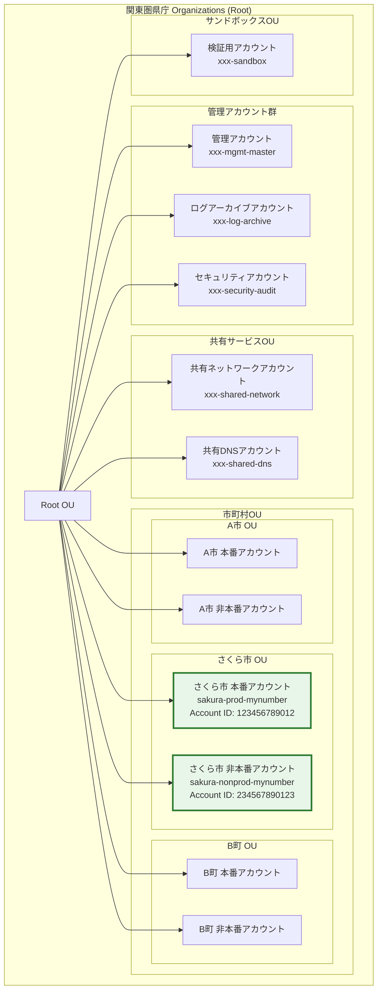

## 改訂履歴

| バージョン | 更新日 | 更新者 | 変更内容 | ステータス |
|-----------|--------|--------|--------|----------|
| 1.0 | 2026-04-06 | gc-environment-design | 初版作成。GC共同利用グループ参加設計、アカウント設計、SCP設計、GCAS-SSO設計、テンプレート適用設計、StackSets設計、運用管理補助者設計を策定 | draft |

## 目次

<!-- TOC -->
- 1. 概要・目的
- 2. GC共同利用グループへの参加設計
- 3. AWSアカウント設計
- 4. SCP設計（共同利用制約）
- 5. GCAS-SSO設計
- 6. GCテンプレート適用設計
- 7. CloudFormation StackSets設計
- 8. 運用管理補助者設計
- 9. セキュリティ考慮事項
- 10. リスク・制限事項
- 11. 今後の検討事項
- 付録
<!-- /TOC -->

---

## 1. 概要・目的

### 1.1 背景

さくら市は、マイナンバーサービス基盤をガバメントクラウド（GC）上に移行するにあたり、関東圏県庁（以下「県庁」）が構築・運用する既存のGC共同利用グループに参加する形態を選択した。本設計書は、共同利用グループへの参加に必要なGC環境全体の設計を定義する。

GCAS（ガバメントクラウド補助システム）に登録済みのサービスプロバイダーが構築・運用を担当し、CCIS（Common Criteria for Information Security）ガイドラインに準拠した環境を実現する。

### 1.2 目的・スコープ

本設計書がカバーする範囲は以下の通りである。

| 項目 | スコープ内 | スコープ外 |
|------|-----------|-----------|
| Organizations構成 | 県庁Organizations配下のさくら市OU/アカウント配置 | 県庁側Organizations自体の構築・変更 |
| SCP設計 | さくら市アカウントに適用されるSCPの設計・確認 | 県庁管理SCPの変更 |
| GCAS-SSO | さくら市職員のSSO/MFA設定 | 県庁側IdPの構築 |
| テンプレート適用 | GC3層テンプレートのさくら市アカウントへの適用 | テンプレート自体の開発 |
| 運用管理補助者 | GCAS要件に基づくロール設定 | 県庁側の運用体制構築 |

### 1.3 制約条件・前提条件

**制約条件:**

| ID | 制約 | 根拠 |
|----|------|------|
| C-01 | ISMAP認定クラウドサービスのみ利用可 | デジタル庁GC利用方針 |
| C-02 | 県庁Organizations配下のOU/アカウント構成に従う | 共同利用グループ規約 |
| C-03 | CCISガイドライン準拠 | 県庁セキュリティ規格 |
| C-04 | マイナンバー関連データは東京リージョン（ap-northeast-1）のみ | 個人情報保護法・番号法 |
| C-05 | GCAS登録済みサービスプロバイダーが構築 | GCAS運用規定 |

**前提条件:**

| ID | 前提 | 確認状況 |
|----|------|---------|
| P-01 | 県庁のGC共同利用グループが構築済みであること | 確認済み |
| P-02 | さくら市専用のAWSアカウントが県庁側で払い出し済みであること | 申請中（2026年5月払い出し予定） |
| P-03 | 県庁側のOrganizations/SCPが適用済みであること | 確認済み |
| P-04 | さくら市のGCAS利用申請が完了していること | 申請済み（2026年3月受理） |
| P-05 | さくら市庁内にActive Directory環境が存在すること | 確認済み（Windows Server 2022 AD DS） |

### 1.4 用語定義

| 用語 | 定義 |
|------|------|
| GC | ガバメントクラウド。デジタル庁が提供するクラウド基盤 |
| GCAS | ガバメントクラウド補助システム。アカウント管理・SSO等を提供 |
| CEP | Compliance Environment Program。セキュリティ強化のための環境設定パッケージ |
| SCP | Service Control Policy。Organizations配下のアカウントに適用するアクセス制御ポリシー |
| CCIS | Common Criteria for Information Security。県庁のセキュリティ基準 |
| 運用管理補助者 | GCAS要件で定められた、GC環境の技術運用を担当する役割 |

---

## 2. GC共同利用グループへの参加設計

### 2.1 参加フローと前提条件

さくら市がGC共同利用グループに参加するフローは以下の通りである。

**参加フロー:**

```
Step 1: 共同利用グループ参加申請
  さくら市 → 県庁（GC共同利用管理者）へ参加申請書を提出
  ↓
Step 2: アカウント払い出し
  県庁がOrganizations配下にさくら市専用アカウントを作成
  OU（さくら市）を作成し、アカウントを配置
  ↓
Step 3: SCP適用
  共同利用グループ共通SCP + さくら市個別SCPを適用
  ↓
Step 4: GCAS-SSO設定
  さくら市職員のSSO設定、MFA有効化
  Permission Set割り当て
  ↓
Step 5: GCテンプレート適用
  Landing Zone → Security Base → Network Base の順に適用
  ↓
Step 6: CEP設定
  CloudTrail、Config、GuardDuty等の共通ポリシー有効化
  ↓
Step 7: 検証・受入テスト
  設定値の正確性検証、アクセステスト、ドリフト検知確認
  ↓
Step 8: 運用開始
  運用管理補助者による日常運用開始
```

**参加前提条件チェックリスト:**

| No | 確認項目 | 確認先 | 状態 |
|----|---------|--------|------|
| 1 | 共同利用グループ利用規約への同意 | 県庁 | 完了 |
| 2 | GCAS利用申請の受理 | デジタル庁 | 完了 |
| 3 | 情報セキュリティポリシーの提出 | 県庁 | 完了 |
| 4 | 運用管理補助者の任命 | さくら市 | 完了 |
| 5 | 費用負担に関する協定締結 | 県庁・さくら市 | 完了 |
| 6 | 庁内AD環境の準備 | さくら市 | 完了 |
| 7 | サービスプロバイダーとの契約 | さくら市 | 完了 |

### 2.2 アカウント構成図

以下にOrganizations全体の中でのさくら市の位置付けを示す。



### 2.3 県庁側との役割分担

| 管理項目 | 県庁（グループ管理者） | さくら市（利用者） | サービスプロバイダー |
|---------|---------------------|------------------|-------------------|
| Organizations管理 | 責任者 | - | - |
| アカウント払い出し | 実施 | 申請 | 支援 |
| 共通SCP管理 | 策定・適用 | 確認 | 助言 |
| さくら市個別SCP | 承認 | 要件提示 | 策定・適用 |
| GCAS-SSO設定 | IdPフェデレーション管理 | ユーザー管理 | 設定実施 |
| GCテンプレート適用 | テンプレート提供 | 受入確認 | 適用実施 |
| CEP設定 | 基本ポリシー提供 | 確認 | 設定実施 |
| ログアーカイブ | S3バケット管理 | ログ参照 | 運用 |
| セキュリティ監査 | 統合監査 | 個別監査対応 | 監査支援 |
| 費用管理 | 請求統合 | 費用確認・支払 | 費用レポート |
| インシデント対応 | エスカレーション先 | 一次対応 | 技術対応 |

---

## 3. AWSアカウント設計

### 3.1 さくら市専用アカウントの用途

さくら市には以下の2つのAWSアカウントを割り当てる。本番と非本番を分離することで、マイナンバー関連データの安全性を確保する。

| アカウント | 用途 | 環境 | 配置OU |
|-----------|------|------|--------|
| sakura-prod-mynumber | マイナンバーサービス基盤の本番環境 | 本番 | 市町村OU > さくら市OU |
| sakura-nonprod-mynumber | 開発・検証・ステージング環境 | 非本番 | 市町村OU > さくら市OU |

**本番アカウント（sakura-prod-mynumber）の利用範囲:**
- マイナンバーカード関連のWebサービス基盤
- 住民向けオンライン申請システム
- 庁内業務システム（LGWAN経由アクセス）
- バックアップ・DR関連リソース

**非本番アカウント（sakura-nonprod-mynumber）の利用範囲:**
- 開発環境（dev）
- 結合テスト環境（stg）
- 性能テスト環境（perf）-- 必要時のみ構築
- IaCテンプレートの検証

### 3.2 アカウント命名規則

```
{自治体略称}-{環境}-{システム名}

命名要素:
  自治体略称: sakura（さくら市）
  環境:       prod / nonprod
  システム名:  mynumber（マイナンバーサービス基盤）
```

**リソース命名規則（アカウント内）:**

```
{env}-{system}-{resource_type}-{identifier}

例:
  prod-mynumber-vpc-main
  prod-mynumber-subnet-public-1a
  prod-mynumber-ec2-app-01
  prod-mynumber-rds-primary
  stg-mynumber-vpc-main
  dev-mynumber-ec2-app-01
```

### 3.3 Organizations OU配置

```
Root OU
├── Core OU（県庁管理）
│   ├── 管理アカウント
│   ├── ログアーカイブアカウント
│   └── セキュリティアカウント
├── Infrastructure OU（県庁管理）
│   ├── 共有ネットワークアカウント
│   └── 共有DNSアカウント
├── Workloads OU（市町村OU）
│   ├── Production OU
│   │   ├── A市 OU
│   │   │   └── a-city-prod-xxx
│   │   ├── さくら市 OU        ← 新規作成
│   │   │   └── sakura-prod-mynumber  ← 新規配置
│   │   └── B町 OU
│   │       └── b-town-prod-xxx
│   └── Non-Production OU
│       ├── A市 OU
│       │   └── a-city-nonprod-xxx
│       ├── さくら市 OU        ← 新規作成
│       │   └── sakura-nonprod-mynumber  ← 新規配置
│       └── B町 OU
│           └── b-town-nonprod-xxx
└── Sandbox OU（検証用）
    └── xxx-sandbox
```

**OU階層の設計根拠:**
- 2段構成（Root → Workloads → Production/Non-Production）を採用
- 市町村単位のOUにより、SCP・タグポリシーの個別適用が可能
- Production/Non-Productionの分離により、本番環境への誤操作リスクを低減

---

## 4. SCP設計（共同利用制約）

### 4.1 共同利用グループから適用されるSCP一覧

県庁が共同利用グループ全体に適用するSCPは以下の通りである。これらはさくら市アカウントにも自動的に適用される。

| SCP名 | 適用OU | 目的 | 種別 |
|-------|--------|------|------|
| scp-deny-leave-org | Root | Organizations離脱の禁止 | 拒否型 |
| scp-deny-root-actions | Root | ルートユーザーの操作制限 | 拒否型 |
| scp-require-imdsv2 | Workloads | EC2メタデータv2の強制 | 拒否型 |
| scp-deny-non-approved-regions | Root | 承認リージョン以外の利用禁止 | 拒否型 |
| scp-deny-s3-public | Workloads | S3バケットのパブリックアクセス禁止 | 拒否型 |
| scp-deny-unencrypted-volumes | Workloads | 暗号化なしEBSボリュームの作成禁止 | 拒否型 |
| scp-protect-cloudtrail | Root | CloudTrail設定の変更禁止 | 拒否型 |
| scp-protect-config | Root | AWS Config設定の変更禁止 | 拒否型 |
| scp-protect-guardduty | Root | GuardDuty設定の変更禁止 | 拒否型 |

### 4.2 さくら市アカウントへの追加SCP

マイナンバーサービス基盤の要件に基づき、さくら市OUに追加で適用するSCPを以下に定義する。

**SCP-01: 承認リージョン制限**

```json
{
  "Version": "2012-10-17",
  "Statement": [
    {
      "Sid": "DenyNonApprovedRegions",
      "Effect": "Deny",
      "Action": "*",
      "Resource": "*",
      "Condition": {
        "StringNotEquals": {
          "aws:RequestedRegion": [
            "ap-northeast-1"
          ]
        },
        "ArnNotLike": {
          "aws:PrincipalARN": [
            "arn:aws:iam::*:role/OrganizationAccountAccessRole"
          ]
        }
      }
    }
  ]
}
```

根拠: マイナンバー関連データは国内データセンター（東京リージョン）のみで処理する要件（C-04）。

**SCP-02: 高リスクサービスの利用制限**

```json
{
  "Version": "2012-10-17",
  "Statement": [
    {
      "Sid": "DenyHighRiskServices",
      "Effect": "Deny",
      "Action": [
        "lightsail:*",
        "gamelift:*",
        "mechanicalturk:*",
        "ground-station:*",
        "iot:*",
        "robomaker:*"
      ],
      "Resource": "*"
    }
  ]
}
```

根拠: マイナンバーサービス基盤に不要なサービスを禁止し、攻撃面を最小化する。

**SCP-03: データ持ち出し防止**

```json
{
  "Version": "2012-10-17",
  "Statement": [
    {
      "Sid": "DenyS3CrossAccountAccess",
      "Effect": "Deny",
      "Action": [
        "s3:PutBucketPolicy",
        "s3:PutBucketAcl",
        "s3:PutObjectAcl"
      ],
      "Resource": "*",
      "Condition": {
        "StringNotEquals": {
          "aws:PrincipalOrgID": "${aws:PrincipalOrgID}"
        }
      }
    },
    {
      "Sid": "DenyExternalSharing",
      "Effect": "Deny",
      "Action": [
        "ram:CreateResourceShare",
        "ram:AssociateResourceShare"
      ],
      "Resource": "*",
      "Condition": {
        "Bool": {
          "ram:AllowsExternalPrincipals": "true"
        }
      }
    }
  ]
}
```

根拠: マイナンバー関連データの組織外への流出を防止する。

**SCP-04: 本番環境の保護（Production OUのみ）**

```json
{
  "Version": "2012-10-17",
  "Statement": [
    {
      "Sid": "DenyDestructiveActionsInProd",
      "Effect": "Deny",
      "Action": [
        "ec2:TerminateInstances",
        "rds:DeleteDBInstance",
        "rds:DeleteDBCluster",
        "s3:DeleteBucket",
        "dynamodb:DeleteTable"
      ],
      "Resource": "*",
      "Condition": {
        "StringNotLike": {
          "aws:PrincipalARN": [
            "arn:aws:iam::*:role/sakura-admin-role",
            "arn:aws:iam::*:role/OrganizationAccountAccessRole"
          ]
        }
      }
    }
  ]
}
```

根拠: 本番環境における誤削除・意図しないリソース破壊を防止する。管理者ロールのみ削除操作を許可。

### 4.3 SCP適用マトリックス

| SCP | Root OU | Core OU | Workloads OU | Production OU | さくら市Prod | さくら市NonProd |
|-----|---------|---------|-------------|--------------|-------------|---------------|
| scp-deny-leave-org | 適用 | 継承 | 継承 | 継承 | 継承 | 継承 |
| scp-deny-root-actions | 適用 | 継承 | 継承 | 継承 | 継承 | 継承 |
| scp-deny-non-approved-regions | 適用 | 継承 | 継承 | 継承 | 継承 | 継承 |
| scp-require-imdsv2 | - | - | 適用 | 継承 | 継承 | 継承 |
| scp-deny-s3-public | - | - | 適用 | 継承 | 継承 | 継承 |
| scp-deny-unencrypted-volumes | - | - | 適用 | 継承 | 継承 | 継承 |
| scp-protect-cloudtrail | 適用 | 継承 | 継承 | 継承 | 継承 | 継承 |
| SCP-01 リージョン制限 | - | - | - | - | 適用 | 適用 |
| SCP-02 高リスクサービス制限 | - | - | - | - | 適用 | 適用 |
| SCP-03 データ持ち出し防止 | - | - | - | - | 適用 | 適用 |
| SCP-04 本番環境保護 | - | - | - | 適用 | 継承 | - |

---

## 5. GCAS-SSO設計

### 5.1 IdP連携設定（庁内ADとのSAML連携）

さくら市庁内のActive Directory（AD DS）とGCAS-SSOをSAML 2.0で連携する。県庁のAWS IAM Identity Center（旧AWS SSO）を経由して認証を行う。

**認証フロー:**

```
さくら市職員（ブラウザ）
    ↓ (1) GCASポータルにアクセス
GCAS SSO ポータル
    ↓ (2) SAML認証リクエスト
県庁 IAM Identity Center
    ↓ (3) SAMLリダイレクト
さくら市 AD FS（Active Directory Federation Services）
    ↓ (4) AD認証（ID/パスワード + MFA）
さくら市 Active Directory
    ↓ (5) SAML Assertion返却
県庁 IAM Identity Center
    ↓ (6) Permission Set に基づくロール割当
AWS Management Console / CLI
```

**IdP連携設定項目:**

| 設定項目 | 値 |
|---------|-----|
| IdP種別 | Active Directory Federation Services (AD FS) |
| SAML Version | 2.0 |
| IdP Entity ID | `https://adfs.sakura-city.lg.jp/adfs/services/trust` |
| SSO URL | `https://adfs.sakura-city.lg.jp/adfs/ls/` |
| 証明書 | さくら市AD FS署名証明書（SHA-256） |
| Name ID Format | `urn:oasis:names:tc:SAML:1.1:nameid-format:emailAddress` |
| 属性マッピング | email -> `${user.email}`, displayName -> `${user.displayName}`, groups -> `${user.memberOf}` |
| セッション有効期間 | 8時間（業務時間内） |
| ユーザー同期方式 | SCIM 2.0による自動同期（日次） |

### 5.2 MFA要件

GCAS要件およびCCISガイドラインに基づき、全ユーザーにMFAを必須とする。

| 対象 | MFA方式 | 導入タイミング |
|------|---------|-------------|
| 運用管理補助者（管理者） | TOTP + ハードウェアセキュリティキー（YubiKey） | SSO設定完了時（即時） |
| システム管理者 | TOTP（Microsoft Authenticator） | SSO設定完了時（即時） |
| 一般利用者（庁内職員） | TOTP（Microsoft Authenticator） | 運用開始後1ヶ月以内 |
| 緊急時Break-Glass用 | ハードウェアセキュリティキー（金庫保管） | SSO設定完了時（即時） |

**MFA導入スケジュール:**

```
Week 1-2: 管理者MFA設定
  - 運用管理補助者・システム管理者のMFA有効化
  - ハードウェアセキュリティキーの配布

Week 3-4: 一般利用者への通知・準備
  - Microsoft Authenticatorのインストール案内
  - MFA登録手順書の配布
  - ヘルプデスク対応体制の確立

Week 5-6: 一般利用者MFA必須化
  - 段階的にMFA強制を有効化（部署単位）
  - 未登録者への個別フォロー

Week 7-8: 検証・安定化
  - MFA関連の問い合わせ対応
  - 緊急時アクセス手順の訓練
```

### 5.3 Permission Set設計（ロール別アクセス権限）

IAM Identity CenterのPermission Setを以下の通り設計する。

| Permission Set名 | 対象グループ | 権限概要 | 適用アカウント | セッション時間 |
|-----------------|------------|---------|-------------|-------------|
| SakuraAdministrator | sakura-gc-admins | フルアクセス（SCP制約内） | 本番・非本番 | 4時間 |
| SakuraNetworkAdmin | sakura-network-team | VPC/TGW/Route53関連の管理権限 | 本番・非本番 | 8時間 |
| SakuraSecurityAudit | sakura-security-team | セキュリティ関連のReadOnly + GuardDuty/SecurityHub操作 | 本番・非本番 | 8時間 |
| SakuraDeveloper | sakura-developers | 開発リソースの作成・管理権限 | 非本番のみ | 8時間 |
| SakuraReadOnly | sakura-readonly-users | 全リソースの読み取り専用 | 本番・非本番 | 8時間 |
| SakuraDBAdmin | sakura-dba-team | RDS/DynamoDB関連の管理権限 | 本番・非本番 | 4時間 |
| SakuraBillingViewer | sakura-finance | 請求情報の読み取り専用 | 本番・非本番 | 8時間 |

**Permission Set詳細（SakuraAdministrator）:**

```json
{
  "Version": "2012-10-17",
  "Statement": [
    {
      "Sid": "AllowAdminAccess",
      "Effect": "Allow",
      "Action": "*",
      "Resource": "*"
    }
  ]
}
```

注: SCPにより、Organizations離脱、ルートユーザー操作、リージョン外利用等は制限される。

**Permission Set詳細（SakuraDeveloper）:**

```json
{
  "Version": "2012-10-17",
  "Statement": [
    {
      "Sid": "AllowDeveloperActions",
      "Effect": "Allow",
      "Action": [
        "ec2:*",
        "ecs:*",
        "ecr:*",
        "lambda:*",
        "s3:*",
        "rds:*",
        "dynamodb:*",
        "cloudwatch:*",
        "logs:*",
        "cloudformation:*",
        "ssm:*",
        "secretsmanager:GetSecretValue",
        "secretsmanager:DescribeSecret",
        "kms:Decrypt",
        "kms:GenerateDataKey",
        "kms:DescribeKey",
        "sts:AssumeRole",
        "tag:*"
      ],
      "Resource": "*"
    },
    {
      "Sid": "DenyDeveloperDangerousActions",
      "Effect": "Deny",
      "Action": [
        "iam:CreateUser",
        "iam:DeleteUser",
        "iam:AttachUserPolicy",
        "iam:CreateRole",
        "iam:DeleteRole",
        "organizations:*",
        "account:*"
      ],
      "Resource": "*"
    }
  ]
}
```

**ADグループとPermission Setのマッピング:**

| ADセキュリティグループ | Permission Set | 想定人数 |
|---------------------|---------------|---------|
| GC-Sakura-Admins | SakuraAdministrator | 2名 |
| GC-Sakura-Network | SakuraNetworkAdmin | 3名 |
| GC-Sakura-Security | SakuraSecurityAudit | 2名 |
| GC-Sakura-Developers | SakuraDeveloper | 8名 |
| GC-Sakura-ReadOnly | SakuraReadOnly | 15名 |
| GC-Sakura-DBA | SakuraDBAdmin | 2名 |
| GC-Sakura-Finance | SakuraBillingViewer | 3名 |

### 5.4 CEP設定

CEP（Compliance Environment Program）として以下のサービスを有効化する。これらは県庁のOrganizations単位での設定を継承しつつ、さくら市アカウント固有の設定を追加する。

| サービス | 設定内容 | 管理主体 | さくら市固有設定 |
|---------|---------|---------|---------------|
| CloudTrail | 全リージョンの管理イベント記録、データイベント（S3/Lambda）記録 | 県庁（Organizations Trail） | ログアーカイブアカウントのS3へ集約 |
| AWS Config | 全リソースの構成記録、マネージドルール適用 | 県庁（Organizations Config） | さくら市固有のカスタムルール追加 |
| GuardDuty | 脅威検知、S3保護、EKS監査ログ監視 | 県庁（委任管理者） | 検出結果のSNS通知先にさくら市チームを追加 |
| Security Hub | CIS Benchmark v1.4.0、AWS Foundational Security Best Practices | 県庁（委任管理者） | さくら市アカウントの検出結果をダッシュボード表示 |
| IAM Access Analyzer | 外部アクセス分析 | さくら市アカウント | アカウント単位で有効化 |
| VPC Flow Logs | 全VPCのフローログ取得 | さくら市アカウント | CloudWatch Logs + S3への二重出力 |

**AWS Config マネージドルール（さくら市アカウント適用）:**

| ルール名 | 目的 | 修復アクション |
|---------|------|-------------|
| encrypted-volumes | EBSボリュームの暗号化確認 | 自動修復（暗号化有効化） |
| rds-storage-encrypted | RDSストレージの暗号化確認 | 通知のみ（手動対応） |
| s3-bucket-server-side-encryption-enabled | S3バケットの暗号化確認 | 自動修復（AES-256有効化） |
| restricted-ssh | SSH(22)のオープンアクセス禁止 | 自動修復（SGルール削除） |
| cloudtrail-enabled | CloudTrailの有効化確認 | 通知のみ |
| multi-region-cloudtrail-enabled | マルチリージョンCloudTrailの確認 | 通知のみ |
| guardduty-enabled-centralized | GuardDutyの有効化確認 | 通知のみ |
| iam-root-access-key-check | ルートアカウントのアクセスキー不存在確認 | 通知のみ（手動削除） |
| mfa-enabled-for-iam-console-access | コンソールアクセスユーザーのMFA確認 | 通知のみ |

---

## 6. GCテンプレート適用設計

### 6.1 適用する3層テンプレートの一覧と適用順序

GCの3層テンプレート体系に基づき、さくら市アカウントに適用するテンプレートを以下に定義する。

**第1層: 基盤テンプレート（必須）**

| テンプレート名 | 適用対象 | 適用順序 | カスタマイズ | 備考 |
|------------|---------|---------|-----------|------|
| Landing Zone | 県庁Organizations全体 | 1 | 禁止（県庁側で適用済み） | さくら市は既存構成に参加 |
| Security Base | さくら市本番・非本番アカウント | 2 | 組織名、リージョンのみ | IAM基盤、KMS鍵、ログ基盤 |
| Network Base | さくら市本番・非本番アカウント | 3 | CIDR、リージョン | VPC、ルーティング、DNS |
| Governance | さくら市OU | 4 | SCP内容（GC推奨設定は維持） | タグ要件含む |

**第2層: 共通テンプレート（推奨）**

| テンプレート名 | 適用対象 | 適用順序 | カスタマイズ | 備考 |
|------------|---------|---------|-----------|------|
| Web Hosting | さくら市本番アカウント | 5 | インスタンスタイプ、ストレージ容量 | マイナンバーWebサービス基盤 |

**第3層: オプションテンプレート（任意）**

| テンプレート名 | 適用対象 | 適用順序 | カスタマイズ | 備考 |
|------------|---------|---------|-----------|------|
| (該当なし) | - | - | - | 現時点では第3層テンプレートの適用は不要 |

**適用判断の根拠:**

```
マイナンバーサービス基盤の要件分析
    ↓
セキュリティ要件（ISMAP必須） → 第1層: Security Base（必須）
    ↓
ガバナンス要件（SCP、タグ） → 第1層: Governance（必須）
    ↓
ネットワーク要件（VPC、LGWAN接続） → 第1層: Network Base（必須）
    ↓
標準Webシステム → 第2層: Web Hosting（推奨）
    ↓
医療/金融特殊要件なし → 第3層: 該当なし
```

### 6.2 テンプレート適用順序と依存関係

```
Landing Zone（県庁側で適用済み）
    │
    ├→ Security Base（適用順序: 2）
    │   ├→ IAM基盤設定
    │   ├→ KMS鍵管理
    │   └→ ログ基盤（CloudTrail/Config連携）
    │
    ├→ Network Base（適用順序: 3）
    │   ├→ VPC設計
    │   ├→ TGWアタッチメント（県庁共有TGWへの接続）
    │   └→ DNS設定
    │
    ├→ Governance（適用順序: 4）
    │   ├→ SCPポリシー
    │   └→ タグ標準化
    │
    └→ Web Hosting（適用順序: 5、Security Base + Network Baseに依存）
        ├→ ALB + Auto Scaling Group
        ├→ RDS（Multi-AZ）
        └→ S3（静的コンテンツ）
```

### 6.3 カスタマイズ可能範囲の明示

| テンプレート | Level 1（禁止） | Level 2（限定的カスタマイズ） | Level 3（自由度高） |
|-----------|---------------|--------------------------|-------------------|
| Landing Zone | IAMロール定義、Organizations階層、CloudTrail/GuardDuty設定 | - | - |
| Security Base | IAM基本ロール、KMS暗号化方式（AES-256）、ログ保持期間（最低1年） | リージョン選択、KMSキーエイリアス名 | アラーム閾値 |
| Network Base | VPCセグメンテーション（Public/Private/Protected分割）、TGW基本設定 | CIDR帯（10.x.x.x/16範囲内）、サブネットサイズ | セキュリティグループルール詳細 |
| Governance | タグキー（environment, owner, cost-center, project） | SCP内容（GC推奨設定を維持した上での追加） | タグ値 |
| Web Hosting | ALB/ASGの基本構成 | インスタンスタイプ、ストレージ容量、Auto Scalingパラメータ | アプリケーション実装、カスタムメトリクス |

### 6.4 タグ戦略

**必須タグ（全リソース）:**

| タグキー | 説明 | 値の例 | 強制方法 |
|---------|------|-------|---------|
| Environment | 環境種別 | prod / stg / dev | SCP + AWS Config Rule |
| Owner | リソース責任者 | sakura-infra-team@sakura-city.lg.jp | SCP + AWS Config Rule |
| CostCenter | コストセンター | sakura-mynumber-2026 | SCP + AWS Config Rule |
| Project | プロジェクト名 | sakura-mynumber | SCP + AWS Config Rule |

**推奨タグ:**

| タグキー | 説明 | 値の例 |
|---------|------|-------|
| BackupPolicy | バックアップポリシー | daily / weekly / monthly / none |
| DisasterRecovery | DR分類 | tier1 / tier2 / tier3 |
| Compliance | コンプライアンス種別 | ismap / ccis |
| DataClassification | データ分類 | public / internal / confidential / restricted |
| ManagedBy | 管理手段 | terraform / cloudformation / manual |
| CreatedDate | 作成日 | 2026-04-06 |

**タグ強制の仕組み:**

```json
{
  "Version": "2012-10-17",
  "Statement": [
    {
      "Sid": "DenyUntaggedResources",
      "Effect": "Deny",
      "Action": [
        "ec2:RunInstances",
        "ec2:CreateVolume",
        "rds:CreateDBInstance",
        "s3:CreateBucket",
        "lambda:CreateFunction"
      ],
      "Resource": "*",
      "Condition": {
        "Null": {
          "aws:RequestTag/Environment": "true",
          "aws:RequestTag/Owner": "true",
          "aws:RequestTag/CostCenter": "true",
          "aws:RequestTag/Project": "true"
        }
      }
    }
  ]
}
```

### 6.5 テンプレート適用スケジュール

| フェーズ | 期間 | 対象 | 作業内容 |
|---------|------|------|---------|
| Phase 1: テンプレート検討 | 2週間 | 本番・非本番 | テンプレート組み合わせ確定、カスタマイズスコープ確認 |
| Phase 2: デプロイ計画作成 | 1週間 | 本番・非本番 | 適用順序決定、ロールバック計画、検証チェックリスト作成 |
| Phase 3-1: 非本番環境適用 | 2週間 | 非本番 | 全テンプレート適用 + 検証テスト |
| Phase 3-2: 本番環境適用 | 2週間 | 本番 | 全テンプレート適用（非本番での検証結果を反映） |
| Phase 4: 検証・最適化 | 2週間 | 本番・非本番 | ドリフト検知、設定値検証、最適化 |

---

## 7. CloudFormation StackSets設計

### 7.1 共通設定の一括展開方法

県庁管理アカウントからCloudFormation StackSetsを使用して、さくら市アカウント（本番・非本番）に共通設定を一括展開する。

| StackSet名 | 展開対象 | 内容 | 管理主体 |
|-----------|---------|------|---------|
| gc-security-baseline | さくら市全アカウント | CloudTrail、Config、GuardDuty、SecurityHub、IAM Access Analyzer | 県庁 |
| gc-logging-config | さくら市全アカウント | CloudWatch Logs設定、ログ保持期間、S3ログバケットポリシー | 県庁 |
| gc-network-baseline | さくら市全アカウント | VPC Flow Logs、DNS設定、NACLデフォルトルール | 県庁 |
| gc-tag-policy | さくら市全アカウント | タグ強制ポリシー（AWS Config Rule） | 県庁 |
| sakura-iam-roles | さくら市全アカウント | さくら市固有のIAMロール・ポリシー | サービスプロバイダー |
| sakura-monitoring | さくら市全アカウント | CloudWatchアラーム、SNSトピック、EventBridgeルール | サービスプロバイダー |

**StackSetsデプロイ戦略:**

```yaml
StackSets Configuration:
  PermissionModel: SERVICE_MANAGED
  AutoDeployment:
    Enabled: true
    RetainStacksOnAccountRemoval: true
  OperationPreferences:
    RegionConcurrencyType: PARALLEL
    FailureTolerancePercentage: 0
    MaxConcurrentPercentage: 100
  DeploymentTargets:
    OrganizationalUnitIds:
      - ou-xxxx-sakura  # さくら市OU
```

### 7.2 自動修復設定

StackSetsのドリフト検知と自動修復を以下の通り設定する。

| 設定項目 | 値 | 説明 |
|---------|-----|------|
| ドリフト検知スケジュール | 毎日 02:00 JST | CloudWatch EventsからLambdaを起動 |
| ドリフト検知対象 | 全StackSet | gc-security-baseline, gc-logging-config, gc-network-baseline, gc-tag-policy |
| 自動修復 | 有効（セキュリティ関連のみ） | gc-security-baseline, gc-logging-configのドリフトは自動修復 |
| 通知先 | sakura-gc-admins@sakura-city.lg.jp | ドリフト検知時にSNS通知 |
| 手動修復対象 | ネットワーク関連 | gc-network-baselineのドリフトは手動対応（影響範囲が大きいため） |

**自動修復Lambda関数の概要:**

```python
# 概要: StackSetsドリフト検知後の自動修復
# トリガー: CloudWatch Events（日次）
# 処理フロー:
#   1. StackSetsのドリフト検知実行
#   2. ドリフトが検出された場合、対象StackInstanceを特定
#   3. セキュリティ関連StackSetの場合、自動でUpdateStackInstances実行
#   4. ネットワーク関連の場合、SNS通知のみ（手動対応）
#   5. 結果をCloudWatch Logsに記録
```

---

## 8. 運用管理補助者設計

### 8.1 GCAS要件に基づく運用管理補助者の設定

GCASの運用規定に基づき、さくら市のGC環境に対して「運用管理補助者」を設定する。運用管理補助者は、デジタル庁が定めるGCASの利用規約において、GC環境の技術的な運用管理を担当する役割である。

**運用管理補助者の体制:**

| 役割 | 担当者 | 所属 | 責任範囲 |
|------|--------|------|---------|
| 運用管理補助者（主担当） | [氏名] | サービスプロバイダー | GC環境全体の技術運用、GCAS窓口対応 |
| 運用管理補助者（副担当） | [氏名] | サービスプロバイダー | 主担当の代理、夜間・休日対応 |
| 利用責任者 | [氏名] | さくら市情報政策課 | 利用承認、費用承認、セキュリティ方針決定 |
| 技術担当者 | [氏名] | さくら市情報政策課 | 庁内AD管理、ユーザー管理 |

### 8.2 権限スコープ

運用管理補助者に付与する権限は以下の通りである。

**運用管理補助者のIAMロール設計:**

| ロール名 | 権限 | 適用アカウント |
|---------|------|-------------|
| sakura-ops-admin | AdministratorAccess（SCP制約内） | 本番・非本番 |
| sakura-ops-readonly | ReadOnlyAccess + CloudWatch操作権限 | 本番・非本番 |
| sakura-ops-security | SecurityAudit + GuardDuty/SecurityHub操作権限 | 本番・非本番 |

**運用管理補助者の操作権限マトリックス:**

| 操作カテゴリ | 主担当 | 副担当 | 利用責任者 | 技術担当者 |
|-----------|--------|--------|----------|-----------|
| AWSリソース作成・変更 | 可 | 可 | 不可 | 不可 |
| AWSリソース削除（本番） | 可（承認後） | 不可 | 承認のみ | 不可 |
| AWSリソース削除（非本番） | 可 | 可 | 不可 | 不可 |
| IAMロール変更 | 可（承認後） | 不可 | 承認のみ | 不可 |
| SCP変更要求 | 可（県庁へ申請） | 不可 | 承認のみ | 不可 |
| セキュリティインシデント対応 | 可 | 可 | 報告受領 | 不可 |
| コスト確認 | 可 | 可 | 可 | 不可 |
| GCAS窓口対応 | 可 | 可（代理） | 不可 | 不可 |
| ユーザー追加・削除 | 要求 | 要求 | 承認 | 実施（AD側） |
| 監査ログ確認 | 可 | 可 | 可 | 不可 |

**GCAS登録情報:**

| 項目 | 内容 |
|------|------|
| 利用団体名 | さくら市 |
| 利用システム名 | マイナンバーサービス基盤 |
| 運用管理補助者（主） | [サービスプロバイダー担当者名] |
| 運用管理補助者（副） | [サービスプロバイダー担当者名] |
| 利用責任者 | [さくら市情報政策課 課長名] |
| 連絡先メール | sakura-gc-ops@sakura-city.lg.jp |
| 緊急連絡先 | [電話番号] |
| 利用開始予定日 | 2026年7月1日 |

### 8.3 運用管理補助者の業務フロー

**日常運用:**

```
毎日 09:00  セキュリティダッシュボード確認（Security Hub）
            GuardDuty検出結果の確認・対応
            AWS Configコンプライアンス状況確認

毎日 10:00  コスト確認（Cost Explorer）
            異常コスト発生時の調査・報告

週次        パッチ適用計画の確認・実施（Systems Manager）
            バックアップ成功確認（AWS Backup）
            StackSetsドリフト検知結果の確認

月次        セキュリティレポート作成（県庁・さくら市へ提出）
            コストレポート作成
            IAMアクセスレビュー（未使用ロール・ポリシーの棚卸し）

四半期       GCAS定期報告
            DR訓練（必要に応じて）
            セキュリティ監査対応
```

---

## 9. セキュリティ考慮事項

### 9.1 ISMAP対応

マイナンバーサービス基盤はISMAP準拠が必須である。以下の統制項目に対応する。

| ISMAP統制領域 | 対応するGC設計要素 | 設計書内の参照 |
|-------------|----------------|-------------|
| アクセス制御（3.1.1） | IAM Identity Center + Permission Set | 5.3節 |
| 暗号化（3.2.1） | KMS（AES-256）、EBS暗号化、RDS暗号化 | 6.3節 |
| ログ管理（3.3.1） | CloudTrail（Organizations Trail）、VPC Flow Logs | 5.4節 |
| 脅威検知（3.4.1） | GuardDuty、Security Hub | 5.4節 |
| 構成管理（3.5.1） | AWS Config、StackSets自動修復 | 5.4節、7.2節 |
| インシデント対応（3.6.1） | EventBridge + SNS通知、Runbook | 8.3節 |

### 9.2 Break-Glass手順

SSO障害時の緊急アクセス手順を以下に定義する。

| 手順 | 内容 | 責任者 |
|------|------|--------|
| 1 | SSO障害を検知・確認 | 運用管理補助者 |
| 2 | 利用責任者へ報告、Break-Glass手順の実行承認を取得 | 運用管理補助者 |
| 3 | 金庫からBreak-Glass用IAMユーザー認証情報を取得 | 運用管理補助者（2名立会い） |
| 4 | Break-Glass用IAMユーザーでAWSコンソールにログイン | 運用管理補助者 |
| 5 | 緊急対応を実施（最小限の操作に限定） | 運用管理補助者 |
| 6 | 対応完了後、Break-Glass用IAMユーザーのアクセスキーをローテート | 運用管理補助者 |
| 7 | 対応内容を記録し、利用責任者・県庁へ報告 | 運用管理補助者 |

---

## 10. リスク・制限事項

### 10.1 リスク一覧

| ID | リスク | 影響度 | 発生確率 | 対応方針 |
|----|-------|--------|---------|---------|
| R-01 | 県庁側SCPの変更によるさくら市環境への影響 | 高 | 低 | 県庁との変更管理プロセスの合意、事前通知ルールの策定 |
| R-02 | GCAS-SSOの障害によるアクセス不能 | 高 | 低 | Break-Glass手順の整備、定期訓練の実施 |
| R-03 | 庁内AD環境の障害によるSSO認証不可 | 中 | 低 | AD冗長化の確認、緊急時ローカルアカウントの準備 |
| R-04 | テンプレート適用時の既存リソースとの競合 | 中 | 中 | 非本番環境での事前検証、ロールバック計画の策定 |
| R-05 | 共同利用グループの費用按分の不透明性 | 低 | 中 | タグ戦略による費用可視化、月次コストレポートの確認 |
| R-06 | 運用管理補助者の退職・変更 | 中 | 中 | 副担当の常時配置、引継ぎ手順書の整備 |

### 10.2 制限事項

| ID | 制限事項 | 影響 | 回避策 |
|----|---------|------|--------|
| L-01 | 県庁Organizations配下のため、Org自体の設定変更はさくら市からは不可 | SCP・Organizations PolicyはOrgレベルで変更不可 | 県庁への変更申請プロセスで対応 |
| L-02 | 利用リージョンはap-northeast-1のみ | DR用の別リージョン利用は追加申請が必要 | 同一リージョン内のMulti-AZ構成でHA確保 |
| L-03 | AWSサービスの利用はSCPで制限される | 新規サービス利用時はSCP変更が必要 | 事前にサービス利用計画を策定し、SCP変更を申請 |
| L-04 | StackSetsは県庁管理アカウントからのみ実行可 | さくら市独自のStackSets展開は不可 | CloudFormation（個別アカウント内）で対応 |

---

## 11. 今後の検討事項

| No | 検討事項 | 期限 | 担当 |
|----|---------|------|------|
| 1 | DR環境の別リージョン利用可否の確認 | 2026年5月末 | サービスプロバイダー |
| 2 | マイナンバーカードの電子証明書検証API連携の設計 | 2026年6月末 | さくら市・サービスプロバイダー |
| 3 | ASP事業者とのクロスアカウントアクセス設計の詳細化 | 2026年5月末 | サービスプロバイダー |
| 4 | 庁内AD環境のAzure AD（Entra ID）への移行計画との整合性確認 | 2026年7月末 | さくら市情報政策課 |
| 5 | GCテンプレートの次期バージョンアップへの対応方針 | 随時 | サービスプロバイダー |
| 6 | 運用自動化（Runbook自動化、自動スケーリング等）の設計 | 2026年8月末 | サービスプロバイダー |

---

## 付録

### A. GCAS申請書類チェックリスト

| No | 書類 | 提出先 | 状態 |
|----|------|--------|------|
| 1 | GC利用申請書 | デジタル庁 | 提出済み |
| 2 | 情報セキュリティポリシー | デジタル庁・県庁 | 提出済み |
| 3 | 運用管理補助者届出書 | デジタル庁 | 提出済み |
| 4 | システム構成図（概要） | デジタル庁 | 提出済み |
| 5 | 移行計画書（概要） | デジタル庁 | 提出済み |
| 6 | 費用見込書 | デジタル庁 | 提出済み |
| 7 | 共同利用グループ参加同意書 | 県庁 | 締結済み |
| 8 | サービスプロバイダー契約書 | さくら市 | 締結済み |

### B. アカウント情報一覧

| 項目 | 本番アカウント | 非本番アカウント |
|------|-------------|---------------|
| アカウント名 | sakura-prod-mynumber | sakura-nonprod-mynumber |
| Account ID | 123456789012 | 234567890123 |
| OU | Workloads > Production > さくら市 | Workloads > Non-Production > さくら市 |
| ルートメール | sakura-prod-root@sakura-city.lg.jp | sakura-nonprod-root@sakura-city.lg.jp |
| リージョン | ap-northeast-1 | ap-northeast-1 |
| 用途 | マイナンバーサービス本番環境 | 開発・検証・ステージング環境 |

### C. SCP一覧（JSON定義）

本文4.2節に記載のSCP-01からSCP-04のJSON定義を参照。

### D. Permission Set一覧

本文5.3節に記載のPermission Set設計を参照。

### E. レファレンス

- デジタル庁「GC全般的ガイド」: https://guide.gcas.cloud.go.jp/general/overview-explanation
- デジタル庁「GC移行マニュアルv3.0」: https://guide.gcas.cloud.go.jp/
- GCAS マニュアル: https://gcas.cloud.go.jp/
- IPA「非機能要求グレード v1.2」: https://www.ipa.go.jp/
- ISMAP管理基準: https://www.ismap.go.jp/
- AWS Well-Architected Framework: https://aws.amazon.com/architecture/well-architected/
- AWS Organizations ユーザーガイド: https://docs.aws.amazon.com/organizations/
- AWS IAM Identity Center ユーザーガイド: https://docs.aws.amazon.com/singlesignon/
