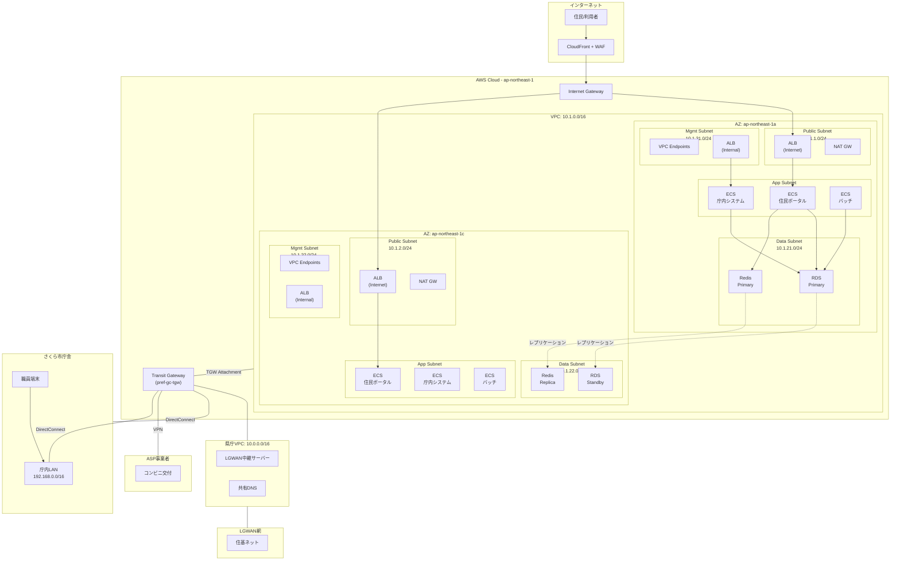

## 改訂履歴

| バージョン | 更新日 | 更新者 | 変更内容 | ステータス |
|-----------|--------|--------|--------|----------|
| 1.0 | 2026-04-06 | infra-network | 初版作成。VPC/サブネット設計、TGW接続、LGWAN接続、SG/NACL、DNS、VPC Endpoint設計を策定 | draft |

## 目次

<!-- TOC -->
- 1. 設計方針
- 2. VPC設計
- 3. サブネット設計
- 4. ルーティング設計
- 5. Transit Gateway設計
- 6. LGWAN接続設計
- 7. セキュリティグループ設計
- 8. Network ACL設計
- 9. DNS設計
- 10. VPC Endpoint設計
- 11. ネットワーク構成図
- 12. 帯域・性能設計
- 13. セキュリティ考慮事項
- 14. リスク・制限事項
- 15. 今後の検討事項
- 付録
<!-- /TOC -->

---

## 1. 設計方針

### 1.1 背景

さくら市マイナンバーサービス基盤をガバメントクラウド（AWS）へ移行するにあたり、住基ネットへのLGWAN接続、住民向けインターネットサービス、庁内業務システム、コンビニ交付連携など多様な接続要件を満たすネットワーク基盤を設計する。本設計は、関東圏県庁グループの共同利用環境に参加する形態をとる。

### 1.2 GCネットワーク設計原則

本設計は以下の原則に基づく。

| 原則 | 説明 |
|------|------|
| ゼロトラスト | デフォルト拒否。通信は必要最小限のみ許可する |
| 多層防御 | WAF、セキュリティグループ、NACL、VPC Endpointによる多層的な制御 |
| 冗長構成 | 2AZ（ap-northeast-1a, ap-northeast-1c）によるMulti-AZ構成 |
| 最小権限 | セキュリティグループルールは送信元・宛先を明示的に限定する |
| 共同利用適合 | 県庁Transit Gatewayへの接続、CIDRアドレス体系の統合 |
| ISMAP準拠 | 通信の暗号化（TLS 1.2以上）、ログ取得、アクセス制御の徹底 |
| GCAS準拠 | GC自動適用テンプレート・必須適用テンプレートへの対応 |

### 1.3 ISMAP対応方針

- 全てのVPC内通信ログをVPC Flow Logsで取得し、S3/CloudWatch Logsへ保存（保持期間: 1年以上）
- 外部向け通信はTLS 1.2以上を必須とする
- 管理アクセスはAWS Systems Manager Session Managerに限定し、SSH/RDPの直接接続を禁止する
- GuardDutyおよびSecurity Hubによる継続的な脅威監視を実施する

### 1.4 制約条件・前提条件

| 項目 | 内容 |
|------|------|
| GC利用形式 | 共同利用（関東圏県庁グループに参加） |
| リージョン | ap-northeast-1（東京） |
| AZ構成 | 2AZ（ap-northeast-1a, ap-northeast-1c） |
| CIDRアドレス体系 | 県庁グループの既存体系に合わせ 10.1.0.0/16 を使用 |
| Transit Gateway | 県庁が管理するTGWにアタッチメントとして参加 |
| LGWAN接続 | LGWAN-ASP接続サービスを利用（県庁経由） |
| ISMAP | 必須対応 |
| CCISガイドライン | 準拠必須 |

---

## 2. VPC設計

### 2.1 VPC基本構成

| 項目 | 値 |
|------|-----|
| VPC名 | sakura-mynumber-prod-vpc |
| CIDR | 10.1.0.0/16 |
| リージョン | ap-northeast-1（東京） |
| DNS解決 | 有効（enableDnsSupport: true） |
| DNSホスト名 | 有効（enableDnsHostnames: true） |
| テナンシー | default |
| IPv6 | 無効（LGWAN環境との互換性を考慮） |

### 2.2 CIDR設計根拠

県庁グループの共同利用環境では、以下のCIDRアドレス体系を採用している。

```
県庁グループ Organizations CIDR: 10.0.0.0/8

県庁（共有サービス）: 10.0.0.0/16  ← 県庁管理（TGWハブ、共通DNS等）
さくら市:             10.1.0.0/16  ← 本設計の対象
A市:                  10.2.0.0/16
B町:                  10.3.0.0/16
（将来拡張用）:       10.4.0.0/16 ～ 10.255.0.0/16
```

10.1.0.0/16 の採用により、65,536個のIPアドレスを確保し、今後3～5年のシステム拡張に十分な余裕を持たせる。

### 2.3 VPC Flow Logs設定

| 項目 | 値 |
|------|-----|
| 送信先 | CloudWatch Logs + S3 |
| ログ形式 | デフォルト（Version 2） |
| フィルタ | ALL（Accept/Reject両方） |
| 集約間隔 | 1分 |
| 保持期間 | CloudWatch Logs: 90日 / S3: 365日 |

---

## 3. サブネット設計

### 3.1 サブネット分割方針

本VPCでは、セキュリティレベルと用途に応じて4層のサブネットを設計する。

| 層 | サブネット種別 | 用途 | インターネットアクセス |
|-----|------------|------|-----------------|
| 第1層 | Public Subnet | ALB（インターネット向け）、NAT Gateway | IGW経由で直接通信可 |
| 第2層 | Application Subnet（Private） | ECS Fargate（住民ポータル、庁内システム、バッチ） | NAT Gateway経由のアウトバウンドのみ |
| 第3層 | Data Subnet（Protected） | RDS for PostgreSQL、ElastiCache for Redis | アウトバウンド不可（VPC Endpoint経由のみ） |
| 第4層 | Management Subnet（Private） | VPC Endpoint、内部ALB | NAT Gateway経由のアウトバウンドのみ |

### 3.2 サブネットCIDR割当表

| サブネット名 | CIDR | AZ | 利用可能IP数 | 用途 |
|-------------|------|-----|------------|------|
| sakura-pub-1a | 10.1.1.0/24 | ap-northeast-1a | 251 | ALB（Internet facing）、NAT Gateway |
| sakura-pub-1c | 10.1.2.0/24 | ap-northeast-1c | 251 | ALB（Internet facing）、NAT Gateway |
| sakura-app-1a | 10.1.11.0/24 | ap-northeast-1a | 251 | ECS Fargate（住民ポータル、庁内システム） |
| sakura-app-1c | 10.1.12.0/24 | ap-northeast-1c | 251 | ECS Fargate（住民ポータル、庁内システム） |
| sakura-data-1a | 10.1.21.0/24 | ap-northeast-1a | 251 | RDS Primary、ElastiCache Primary |
| sakura-data-1c | 10.1.22.0/24 | ap-northeast-1c | 251 | RDS Standby、ElastiCache Replica |
| sakura-mgmt-1a | 10.1.31.0/24 | ap-northeast-1a | 251 | VPC Endpoint、内部ALB |
| sakura-mgmt-1c | 10.1.32.0/24 | ap-northeast-1c | 251 | VPC Endpoint、内部ALB |
| sakura-tgw-1a | 10.1.41.0/28 | ap-northeast-1a | 11 | TGW Attachment |
| sakura-tgw-1c | 10.1.41.16/28 | ap-northeast-1c | 11 | TGW Attachment |

### 3.3 CIDR割当の余裕

```
使用済みCIDR:
  10.1.1.0/24 ～ 10.1.2.0/24     (Public: 2ブロック)
  10.1.11.0/24 ～ 10.1.12.0/24   (App: 2ブロック)
  10.1.21.0/24 ～ 10.1.22.0/24   (Data: 2ブロック)
  10.1.31.0/24 ～ 10.1.32.0/24   (Mgmt: 2ブロック)
  10.1.41.0/28 ～ 10.1.41.16/28  (TGW: 2ブロック)

未使用（拡張用）:
  10.1.3.0/24 ～ 10.1.10.0/24    (Public拡張: 8ブロック)
  10.1.13.0/24 ～ 10.1.20.0/24   (App拡張: 8ブロック)
  10.1.23.0/24 ～ 10.1.30.0/24   (Data拡張: 8ブロック)
  10.1.33.0/24 ～ 10.1.40.0/24   (Mgmt拡張: 8ブロック)
  10.1.42.0/24 ～ 10.1.255.0/24  (将来用途: 214ブロック)
```

現在の利用率は約4%（10ブロック/256ブロック）であり、将来のシステム拡張に十分な余裕を確保している。

---

## 4. ルーティング設計

### 4.1 ルートテーブル一覧

本VPCでは、サブネット層ごとに個別のルートテーブルを作成し、通信制御を明確に分離する。

| ルートテーブル名 | 関連サブネット | 説明 |
|---------------|------------|------|
| sakura-rt-public | sakura-pub-1a, sakura-pub-1c | インターネット通信用 |
| sakura-rt-app-1a | sakura-app-1a | アプリケーション層（AZ-a） |
| sakura-rt-app-1c | sakura-app-1c | アプリケーション層（AZ-c） |
| sakura-rt-data | sakura-data-1a, sakura-data-1c | データ層（外部通信なし） |
| sakura-rt-mgmt-1a | sakura-mgmt-1a | 管理層（AZ-a） |
| sakura-rt-mgmt-1c | sakura-mgmt-1c | 管理層（AZ-c） |
| sakura-rt-tgw | sakura-tgw-1a, sakura-tgw-1c | TGW Attachment用 |

### 4.2 ルートテーブル詳細

#### sakura-rt-public（Public Subnet）

| Destination | Target | 備考 |
|-------------|--------|------|
| 10.1.0.0/16 | local | VPC内通信 |
| 0.0.0.0/0 | igw-xxxxxxxx | Internet Gateway |
| 10.0.0.0/16 | tgw-xxxxxxxx | 県庁VPCへ（TGW経由） |

#### sakura-rt-app-1a（Application Subnet AZ-a）

| Destination | Target | 備考 |
|-------------|--------|------|
| 10.1.0.0/16 | local | VPC内通信 |
| 0.0.0.0/0 | nat-xxxxxxxx（AZ-a） | NAT Gateway（同一AZ） |
| 10.0.0.0/16 | tgw-xxxxxxxx | 県庁VPCへ（TGW経由） |
| 192.168.0.0/16 | tgw-xxxxxxxx | さくら市庁舎オンプレミスへ（TGW経由） |

#### sakura-rt-app-1c（Application Subnet AZ-c）

| Destination | Target | 備考 |
|-------------|--------|------|
| 10.1.0.0/16 | local | VPC内通信 |
| 0.0.0.0/0 | nat-xxxxxxxx（AZ-c） | NAT Gateway（同一AZ） |
| 10.0.0.0/16 | tgw-xxxxxxxx | 県庁VPCへ（TGW経由） |
| 192.168.0.0/16 | tgw-xxxxxxxx | さくら市庁舎オンプレミスへ（TGW経由） |

#### sakura-rt-data（Data Subnet）

| Destination | Target | 備考 |
|-------------|--------|------|
| 10.1.0.0/16 | local | VPC内通信 |
| （S3/DynamoDB） | vpce-xxxxxxxx | Gateway Endpoint経由 |

**注意**: Data Subnetにはデフォルトルート（0.0.0.0/0）を設定しない。外部通信はVPC Endpoint経由のみとする。

#### sakura-rt-tgw（TGW Attachment Subnet）

| Destination | Target | 備考 |
|-------------|--------|------|
| 10.1.0.0/16 | local | VPC内通信 |

### 4.3 NAT Gateway配置

各AZに1台ずつNAT Gatewayを配置し、クロスAZ通信コストを回避する。

| NAT Gateway | 配置サブネット | Elastic IP | 対象 |
|------------|-------------|-----------|------|
| sakura-natgw-1a | sakura-pub-1a | eip-xxxxxxxx-a | sakura-app-1a, sakura-mgmt-1a |
| sakura-natgw-1c | sakura-pub-1c | eip-xxxxxxxx-c | sakura-app-1c, sakura-mgmt-1c |

### 4.4 Internet Gateway

| 項目 | 値 |
|------|-----|
| IGW名 | sakura-igw |
| アタッチ先 | sakura-mynumber-prod-vpc |
| 用途 | Public Subnetへのインターネットアクセス（ALBインバウンド、NAT GWアウトバウンド） |

---

## 5. Transit Gateway設計

### 5.1 概要

さくら市は県庁が管理するTransit Gateway（TGW）に参加する形態をとる。TGW自体は県庁アカウントが所有し、AWS Resource Access Manager（RAM）を通じてさくら市アカウントに共有される。

### 5.2 TGW接続構成

```
県庁アカウント（TGWオーナー）
  └─ Transit Gateway: pref-gc-tgw
       ├─ Attachment: 県庁VPC (10.0.0.0/16)
       │    └─ LGWAN接続、共通DNS、共有サービス
       ├─ Attachment: さくら市VPC (10.1.0.0/16)  ← 本設計対象
       ├─ Attachment: A市VPC (10.2.0.0/16)
       ├─ Attachment: B町VPC (10.3.0.0/16)
       └─ Attachment: DirectConnect Gateway
            └─ さくら市庁舎オンプレミス (192.168.0.0/16)
```

### 5.3 TGW Attachment設計

| 項目 | 値 |
|------|-----|
| Attachment名 | sakura-tgw-attachment |
| Attachment種別 | VPC Attachment |
| TGW ID | tgw-xxxxxxxx（県庁管理） |
| VPC | sakura-mynumber-prod-vpc |
| サブネット | sakura-tgw-1a (10.1.41.0/28), sakura-tgw-1c (10.1.41.16/28) |
| アプライアンスモード | 無効 |
| DNS Support | 有効 |

### 5.4 TGWルートテーブル

県庁管理のTGWルートテーブルにおいて、さくら市VPCに関連する経路は以下の通り。

**TGW Route Table（県庁側で管理）**:

| Destination | Target | 種別 |
|-------------|--------|------|
| 10.0.0.0/16 | 県庁VPC Attachment | Static |
| 10.1.0.0/16 | さくら市VPC Attachment | Static |
| 10.2.0.0/16 | A市VPC Attachment | Static |
| 10.3.0.0/16 | B町VPC Attachment | Static |
| 192.168.0.0/16 | DirectConnect Gateway | Static |
| 172.16.0.0/12 | LGWAN接続 | Static |

### 5.5 TGWルーティング分離

セキュリティ上、自治体間の直接通信は制限し、県庁共有サービスのみを経由する。

| 通信元 | 通信先 | 許可/拒否 | 経路 |
|--------|--------|---------|------|
| さくら市VPC | 県庁VPC（共有サービス） | 許可 | TGW直接 |
| さくら市VPC | LGWAN | 許可 | TGW → 県庁VPC → LGWAN |
| さくら市VPC | さくら市庁舎（オンプレ） | 許可 | TGW → DirectConnect |
| さくら市VPC | A市VPC | 拒否 | TGW Route Table Associationで分離 |
| さくら市VPC | B町VPC | 拒否 | TGW Route Table Associationで分離 |

---

## 6. LGWAN接続設計

### 6.1 接続構成概要

さくら市はLGWAN-ASP接続サービスを利用し、県庁経由で住基ネットへ接続する。

```
さくら市庁舎
  ├─ 庁内LAN (192.168.0.0/16)
  │    └─ 庁内端末（住民課窓口等）
  ↓
県庁LGWAN中継拠点
  ├─ LGWAN接続ルーター
  ↓
LGWAN (行政専用ネットワーク)
  ├─ LGWAN-ASP接続サービス
  ↓
県庁VPC (10.0.0.0/16)
  ├─ LGWAN中継サーバー群
  ↓
Transit Gateway (pref-gc-tgw)
  ↓
さくら市VPC (10.1.0.0/16)
  ├─ Application Subnet
  │    └─ ECS Fargate（庁内システム）
  ↓
住基ネット（マイナンバー連携）
```

### 6.2 LGWAN接続パターン

本設計では「LGWAN-ASP接続サービス + Transit Gateway」パターンを採用する。

| 項目 | 値 |
|------|-----|
| 接続方式 | LGWAN-ASP接続サービス（県庁一括契約） |
| 接続経路 | さくら市庁舎 → 県庁LGWAN → LGWAN-ASP → 県庁VPC → TGW → さくら市VPC |
| 帯域 | 100Mbps（県庁グループ共有、さくら市割当: 20Mbps） |
| 冗長構成 | LGWAN: 2系統（県庁側で冗長化済み） |
| 暗号化 | LGWAN網内は行政ネットワーク標準、VPC内はTLS 1.2以上 |

### 6.3 住基ネット接続フロー

住基ネットへの通信フローは以下の通り。

```
1. 庁内端末（住民課窓口）→ 庁内LAN → 県庁LGWAN中継
2. 県庁LGWAN中継 → LGWAN → LGWAN-ASP
3. LGWAN-ASP → 県庁VPC（LGWAN中継サーバー）
4. 県庁VPC → TGW → さくら市VPC（Application Subnet）
5. ECS Fargate（庁内システム）→ 住基ネットAPI
```

### 6.4 コンビニ交付連携

コンビニ交付はASP事業者（富士通Japan等）が提供するVPN接続経由で実現する。

| 項目 | 値 |
|------|-----|
| 接続方式 | Site-to-Site VPN（ASP事業者側が提供） |
| 接続経路 | コンビニ端末 → ASP事業者 → VPN → TGW → さくら市VPC |
| プロトコル | REST API over HTTPS |
| 帯域 | 10Mbps（VPN） |
| 認証 | クライアント証明書 + APIキー |

### 6.5 オンプレミス接続（DirectConnect）

さくら市庁舎とGC間は、県庁が管理するDirectConnect経由で接続する。

| 項目 | 値 |
|------|-----|
| 接続方式 | DirectConnect（県庁一括契約、共用） |
| 帯域 | 1Gbps（県庁グループ共有） |
| さくら市割当帯域 | 200Mbps |
| 冗長構成 | DirectConnect 2系統（東京ロケーション、大阪ロケーション） |
| バックアップ | Site-to-Site VPN（DirectConnect障害時自動切替） |
| フェイルオーバー時間 | 5分以内（BGP経路収束） |

---

## 7. セキュリティグループ設計

### 7.1 設計方針

- デフォルト拒否（すべてのインバウンド/アウトバウンドを明示的に許可）
- セキュリティグループ間参照（CIDR指定よりもSG参照を優先）
- 各コンポーネントに専用のセキュリティグループを割り当て
- ルール数は1SG当たり50ルール以下に抑制

### 7.2 セキュリティグループ一覧

| SG名 | 対象リソース | 説明 |
|------|-----------|------|
| sg-alb-internet | ALB（Internet facing） | 住民向けALB |
| sg-alb-internal | ALB（Internal） | 庁内向けALB |
| sg-ecs-portal | ECS Fargate（住民ポータル） | 住民ポータルサービス |
| sg-ecs-internal | ECS Fargate（庁内システム） | 庁内業務サービス |
| sg-ecs-batch | ECS Fargate（バッチワーカー） | バッチ処理サービス |
| sg-rds | RDS for PostgreSQL | データベース |
| sg-redis | ElastiCache for Redis | キャッシュ |
| sg-vpce | VPC Endpoint | Interface Endpoint |

### 7.3 セキュリティグループ詳細

#### sg-alb-internet（住民向けALB）

**Inbound:**

| ルール | プロトコル | ポート | ソース | 備考 |
|--------|---------|-------|--------|------|
| HTTPS | TCP | 443 | 0.0.0.0/0 | CloudFront経由の住民アクセス |

**Outbound:**

| ルール | プロトコル | ポート | 宛先 | 備考 |
|--------|---------|-------|------|------|
| App | TCP | 8080 | sg-ecs-portal | ECS住民ポータルへ |

**注意**: 実運用ではCloudFrontのIPレンジをソースに限定する（AWS公開IP Prefix Listを使用）。

#### sg-alb-internal（庁内向けALB）

**Inbound:**

| ルール | プロトコル | ポート | ソース | 備考 |
|--------|---------|-------|--------|------|
| HTTPS | TCP | 443 | 10.0.0.0/16 | 県庁VPCから |
| HTTPS | TCP | 443 | 192.168.0.0/16 | さくら市庁舎オンプレから |
| HTTPS | TCP | 443 | 10.1.0.0/16 | VPC内部から |

**Outbound:**

| ルール | プロトコル | ポート | 宛先 | 備考 |
|--------|---------|-------|------|------|
| App | TCP | 8080 | sg-ecs-internal | ECS庁内システムへ |

#### sg-ecs-portal（住民ポータルECS）

**Inbound:**

| ルール | プロトコル | ポート | ソース | 備考 |
|--------|---------|-------|--------|------|
| App | TCP | 8080 | sg-alb-internet | Internet ALBから |

**Outbound:**

| ルール | プロトコル | ポート | 宛先 | 備考 |
|--------|---------|-------|------|------|
| PostgreSQL | TCP | 5432 | sg-rds | RDSへ |
| Redis | TCP | 6379 | sg-redis | ElastiCacheへ |
| HTTPS | TCP | 443 | 0.0.0.0/0 | 外部API（マイナポータル等） |
| HTTPS | TCP | 443 | sg-vpce | VPC Endpointへ |

#### sg-ecs-internal（庁内システムECS）

**Inbound:**

| ルール | プロトコル | ポート | ソース | 備考 |
|--------|---------|-------|--------|------|
| App | TCP | 8080 | sg-alb-internal | Internal ALBから |

**Outbound:**

| ルール | プロトコル | ポート | 宛先 | 備考 |
|--------|---------|-------|------|------|
| PostgreSQL | TCP | 5432 | sg-rds | RDSへ |
| Redis | TCP | 6379 | sg-redis | ElastiCacheへ |
| HTTPS | TCP | 443 | 10.0.0.0/16 | 県庁VPC（LGWAN中継）へ |
| HTTPS | TCP | 443 | sg-vpce | VPC Endpointへ |

#### sg-ecs-batch（バッチワーカーECS）

**Inbound:**

| ルール | プロトコル | ポート | ソース | 備考 |
|--------|---------|-------|--------|------|
| （なし） | - | - | - | インバウンド不要（バッチはプル型） |

**Outbound:**

| ルール | プロトコル | ポート | 宛先 | 備考 |
|--------|---------|-------|------|------|
| PostgreSQL | TCP | 5432 | sg-rds | RDSへ |
| Redis | TCP | 6379 | sg-redis | ElastiCacheへ |
| HTTPS | TCP | 443 | 0.0.0.0/0 | 外部連携（NAT GW経由） |
| HTTPS | TCP | 443 | sg-vpce | VPC Endpointへ |

#### sg-rds（RDS for PostgreSQL）

**Inbound:**

| ルール | プロトコル | ポート | ソース | 備考 |
|--------|---------|-------|--------|------|
| PostgreSQL | TCP | 5432 | sg-ecs-portal | 住民ポータルから |
| PostgreSQL | TCP | 5432 | sg-ecs-internal | 庁内システムから |
| PostgreSQL | TCP | 5432 | sg-ecs-batch | バッチワーカーから |

**Outbound:**

| ルール | プロトコル | ポート | 宛先 | 備考 |
|--------|---------|-------|------|------|
| （デフォルト拒否） | - | - | - | 原則アウトバウンド不要 |

#### sg-redis（ElastiCache for Redis）

**Inbound:**

| ルール | プロトコル | ポート | ソース | 備考 |
|--------|---------|-------|--------|------|
| Redis | TCP | 6379 | sg-ecs-portal | 住民ポータルから |
| Redis | TCP | 6379 | sg-ecs-internal | 庁内システムから |
| Redis | TCP | 6379 | sg-ecs-batch | バッチワーカーから |

**Outbound:**

| ルール | プロトコル | ポート | 宛先 | 備考 |
|--------|---------|-------|------|------|
| （デフォルト拒否） | - | - | - | 原則アウトバウンド不要 |

#### sg-vpce（VPC Endpoint）

**Inbound:**

| ルール | プロトコル | ポート | ソース | 備考 |
|--------|---------|-------|--------|------|
| HTTPS | TCP | 443 | 10.1.0.0/16 | VPC内全体から |

**Outbound:**

| ルール | プロトコル | ポート | 宛先 | 備考 |
|--------|---------|-------|------|------|
| （デフォルト許可） | - | - | - | AWSサービスへの通信 |

---

## 8. Network ACL設計

### 8.1 設計方針

NACLはサブネット層間の境界防御として補完的に使用する。NACLはステートレスであるため、リターントラフィック（エフェメラルポート）の許可を明示的に設定する。

### 8.2 NACL一覧

| NACL名 | 関連サブネット |
|--------|-------------|
| nacl-public | sakura-pub-1a, sakura-pub-1c |
| nacl-app | sakura-app-1a, sakura-app-1c |
| nacl-data | sakura-data-1a, sakura-data-1c |
| nacl-mgmt | sakura-mgmt-1a, sakura-mgmt-1c |

### 8.3 NACL詳細

#### nacl-public（Public Subnet）

**Inbound:**

| ルール番号 | プロトコル | ポート | ソース | 許可/拒否 | 備考 |
|-----------|---------|-------|--------|---------|------|
| 100 | TCP | 443 | 0.0.0.0/0 | Allow | HTTPS（Internet） |
| 110 | TCP | 80 | 0.0.0.0/0 | Allow | HTTP（リダイレクト用） |
| 120 | TCP | 1024-65535 | 10.1.0.0/16 | Allow | VPC内リターントラフィック |
| 130 | TCP | 1024-65535 | 0.0.0.0/0 | Allow | Internet側リターントラフィック |
| 32767 | ALL | ALL | 0.0.0.0/0 | Deny | デフォルト拒否 |

**Outbound:**

| ルール番号 | プロトコル | ポート | 宛先 | 許可/拒否 | 備考 |
|-----------|---------|-------|------|---------|------|
| 100 | TCP | 443 | 0.0.0.0/0 | Allow | HTTPS（外部） |
| 110 | TCP | 80 | 0.0.0.0/0 | Allow | HTTP |
| 120 | TCP | 8080 | 10.1.11.0/24 | Allow | App Subnet AZ-aへ |
| 121 | TCP | 8080 | 10.1.12.0/24 | Allow | App Subnet AZ-cへ |
| 130 | TCP | 1024-65535 | 0.0.0.0/0 | Allow | リターントラフィック |
| 32767 | ALL | ALL | 0.0.0.0/0 | Deny | デフォルト拒否 |

#### nacl-app（Application Subnet）

**Inbound:**

| ルール番号 | プロトコル | ポート | ソース | 許可/拒否 | 備考 |
|-----------|---------|-------|--------|---------|------|
| 100 | TCP | 8080 | 10.1.1.0/24 | Allow | Public Subnet AZ-aから |
| 101 | TCP | 8080 | 10.1.2.0/24 | Allow | Public Subnet AZ-cから |
| 110 | TCP | 8080 | 10.1.31.0/24 | Allow | Mgmt Subnet AZ-aから（内部ALB） |
| 111 | TCP | 8080 | 10.1.32.0/24 | Allow | Mgmt Subnet AZ-cから（内部ALB） |
| 120 | TCP | 1024-65535 | 0.0.0.0/0 | Allow | リターントラフィック |
| 130 | TCP | 1024-65535 | 10.1.0.0/16 | Allow | VPC内リターントラフィック |
| 32767 | ALL | ALL | 0.0.0.0/0 | Deny | デフォルト拒否 |

**Outbound:**

| ルール番号 | プロトコル | ポート | 宛先 | 許可/拒否 | 備考 |
|-----------|---------|-------|------|---------|------|
| 100 | TCP | 5432 | 10.1.21.0/24 | Allow | Data Subnet AZ-aへ |
| 101 | TCP | 5432 | 10.1.22.0/24 | Allow | Data Subnet AZ-cへ |
| 110 | TCP | 6379 | 10.1.21.0/24 | Allow | ElastiCache AZ-aへ |
| 111 | TCP | 6379 | 10.1.22.0/24 | Allow | ElastiCache AZ-cへ |
| 120 | TCP | 443 | 0.0.0.0/0 | Allow | HTTPS（外部API、VPC Endpoint） |
| 130 | TCP | 1024-65535 | 0.0.0.0/0 | Allow | リターントラフィック |
| 32767 | ALL | ALL | 0.0.0.0/0 | Deny | デフォルト拒否 |

#### nacl-data（Data Subnet）

**Inbound:**

| ルール番号 | プロトコル | ポート | ソース | 許可/拒否 | 備考 |
|-----------|---------|-------|--------|---------|------|
| 100 | TCP | 5432 | 10.1.11.0/24 | Allow | App Subnet AZ-aから |
| 101 | TCP | 5432 | 10.1.12.0/24 | Allow | App Subnet AZ-cから |
| 110 | TCP | 6379 | 10.1.11.0/24 | Allow | App Subnet AZ-aから |
| 111 | TCP | 6379 | 10.1.12.0/24 | Allow | App Subnet AZ-cから |
| 32767 | ALL | ALL | 0.0.0.0/0 | Deny | デフォルト拒否 |

**Outbound:**

| ルール番号 | プロトコル | ポート | 宛先 | 許可/拒否 | 備考 |
|-----------|---------|-------|------|---------|------|
| 100 | TCP | 1024-65535 | 10.1.11.0/24 | Allow | App Subnet AZ-aへリターン |
| 101 | TCP | 1024-65535 | 10.1.12.0/24 | Allow | App Subnet AZ-cへリターン |
| 32767 | ALL | ALL | 0.0.0.0/0 | Deny | デフォルト拒否 |

#### nacl-mgmt（Management Subnet）

**Inbound:**

| ルール番号 | プロトコル | ポート | ソース | 許可/拒否 | 備考 |
|-----------|---------|-------|--------|---------|------|
| 100 | TCP | 443 | 10.1.0.0/16 | Allow | VPC内からVPC Endpointへ |
| 110 | TCP | 1024-65535 | 0.0.0.0/0 | Allow | リターントラフィック |
| 32767 | ALL | ALL | 0.0.0.0/0 | Deny | デフォルト拒否 |

**Outbound:**

| ルール番号 | プロトコル | ポート | 宛先 | 許可/拒否 | 備考 |
|-----------|---------|-------|------|---------|------|
| 100 | TCP | 443 | 0.0.0.0/0 | Allow | AWSサービスへ |
| 110 | TCP | 8080 | 10.1.11.0/24 | Allow | App Subnet AZ-aへ |
| 111 | TCP | 8080 | 10.1.12.0/24 | Allow | App Subnet AZ-cへ |
| 120 | TCP | 1024-65535 | 10.1.0.0/16 | Allow | リターントラフィック |
| 32767 | ALL | ALL | 0.0.0.0/0 | Deny | デフォルト拒否 |

---

## 9. DNS設計

### 9.1 DNS構成概要

| コンポーネント | 用途 |
|-------------|------|
| Route 53 Private Hosted Zone | VPC内部の名前解決 |
| Route 53 Resolver Inbound Endpoint | オンプレミスからVPC内DNSの解決 |
| Route 53 Resolver Outbound Endpoint | VPCからオンプレミスDNSの解決 |
| Route 53 Resolver Rules | 条件付きフォワーディング |

### 9.2 Private Hosted Zone

| 項目 | 値 |
|------|-----|
| Zone名 | sakura.gc.internal |
| 関連VPC | sakura-mynumber-prod-vpc |

**レコード一覧:**

| レコード名 | タイプ | 値 | TTL | 備考 |
|-----------|-------|-----|-----|------|
| portal.sakura.gc.internal | A (Alias) | ALB（Internet facing）のDNS名 | - | 住民ポータル |
| internal.sakura.gc.internal | A (Alias) | ALB（Internal）のDNS名 | - | 庁内システム |
| db.sakura.gc.internal | CNAME | RDSクラスターエンドポイント | 60 | PostgreSQL |
| db-ro.sakura.gc.internal | CNAME | RDS読取エンドポイント | 60 | PostgreSQL（読取） |
| cache.sakura.gc.internal | CNAME | ElastiCacheエンドポイント | 60 | Redis |

### 9.3 条件付きフォワーディング

| ドメイン | 転送先 | 備考 |
|---------|--------|------|
| sakura.lg.jp | 192.168.1.10, 192.168.1.11 | さくら市庁舎DNSサーバー |
| pref.gc.internal | 10.0.0.10, 10.0.0.11 | 県庁共有DNS |
| lgwan.jp | 県庁LGWAN中継DNS経由 | LGWAN内DNSの解決 |

### 9.4 Route 53 Resolver Endpoint

**Inbound Endpoint（オンプレ→VPC方向）:**

| 項目 | 値 |
|------|-----|
| 配置サブネット | sakura-mgmt-1a, sakura-mgmt-1c |
| IPアドレス | 10.1.31.10 (AZ-a), 10.1.32.10 (AZ-c) |
| セキュリティグループ | sg-vpce |

**Outbound Endpoint（VPC→オンプレ方向）:**

| 項目 | 値 |
|------|-----|
| 配置サブネット | sakura-mgmt-1a, sakura-mgmt-1c |
| IPアドレス | 10.1.31.20 (AZ-a), 10.1.32.20 (AZ-c) |
| セキュリティグループ | sg-vpce |

### 9.5 DNS解決フロー

```
[VPC内リソース]
  ↓ 名前解決リクエスト
Route 53 Resolver
  ├─ sakura.gc.internal → Private Hosted Zone で解決
  ├─ sakura.lg.jp       → Outbound Endpoint → 192.168.1.10（庁舎DNS）
  ├─ pref.gc.internal   → Outbound Endpoint → 10.0.0.10（県庁DNS）
  ├─ lgwan.jp           → Outbound Endpoint → 県庁LGWAN DNS
  └─ その他             → Route 53 Public Resolver（インターネットDNS）
```

---

## 10. VPC Endpoint設計

### 10.1 設計方針

- ECS Fargate運用に必要なAWSサービスへのアクセスはVPC Endpoint経由とし、NAT Gatewayを経由するトラフィックを削減する
- Data Subnet（RDS、ElastiCache）からの外部通信はVPC Endpoint以外を許可しない
- Gateway EndpointはS3/DynamoDBに使用（無料）
- Interface Endpointは必要最小限に絞り、コストを最適化する

### 10.2 VPC Endpoint一覧

#### Gateway Endpoint

| サービス | Endpoint名 | ルートテーブル | ポリシー |
|---------|-----------|-------------|---------|
| S3 | sakura-vpce-s3 | 全ルートテーブル | さくら市アカウントのバケットのみ許可 |
| DynamoDB | sakura-vpce-dynamodb | 全ルートテーブル | デフォルト（Full Access） |

#### Interface Endpoint

| サービス | Endpoint名 | 配置サブネット | 用途 |
|---------|-----------|-------------|------|
| ecr.api | sakura-vpce-ecr-api | sakura-mgmt-1a/1c | ECRイメージプル |
| ecr.dkr | sakura-vpce-ecr-dkr | sakura-mgmt-1a/1c | ECR Dockerレジストリ |
| logs | sakura-vpce-logs | sakura-mgmt-1a/1c | CloudWatch Logs送信 |
| monitoring | sakura-vpce-monitoring | sakura-mgmt-1a/1c | CloudWatch Metrics送信 |
| ssm | sakura-vpce-ssm | sakura-mgmt-1a/1c | Systems Manager |
| ssmmessages | sakura-vpce-ssmmessages | sakura-mgmt-1a/1c | Session Manager |
| ec2messages | sakura-vpce-ec2messages | sakura-mgmt-1a/1c | SSM Agent通信 |
| secretsmanager | sakura-vpce-secretsmanager | sakura-mgmt-1a/1c | Secrets Manager |
| kms | sakura-vpce-kms | sakura-mgmt-1a/1c | KMS暗号化操作 |
| sts | sakura-vpce-sts | sakura-mgmt-1a/1c | STS AssumeRole |
| execute-api | sakura-vpce-execute-api | sakura-mgmt-1a/1c | API Gateway Private |

### 10.3 VPC Endpointセキュリティ

全Interface Endpointに共通のセキュリティグループ（sg-vpce）を適用する。VPC Endpointポリシーにより、アクセス可能なリソースを制限する。

**S3 Gateway Endpoint ポリシー例:**

```json
{
  "Version": "2012-10-17",
  "Statement": [
    {
      "Sid": "AllowAccountBucketsOnly",
      "Effect": "Allow",
      "Principal": "*",
      "Action": [
        "s3:GetObject",
        "s3:PutObject",
        "s3:ListBucket"
      ],
      "Resource": [
        "arn:aws:s3:::sakura-mynumber-*",
        "arn:aws:s3:::sakura-mynumber-*/*"
      ]
    },
    {
      "Sid": "AllowECRAccess",
      "Effect": "Allow",
      "Principal": "*",
      "Action": "s3:GetObject",
      "Resource": "arn:aws:s3:::prod-ap-northeast-1-starport-layer-bucket/*"
    }
  ]
}
```

---

## 11. ネットワーク構成図

### 11.1 全体構成図（テキスト表現）

```
                        +--------------+
                        |   住民/利用者  |
                        +--------------+
                              |
                        [インターネット]
                              |
                    +-------------------+
                    | CloudFront + WAF  |
                    +-------------------+
                              |
                    +-------------------+
                    |   Internet GW     |
                    +-------------------+
                              |
+=========================================================================+
|  AWS Cloud - ap-northeast-1                                             |
|  +===================================================================+  |
|  |  VPC: sakura-mynumber-prod-vpc (10.1.0.0/16)                      |  |
|  |                                                                   |  |
|  |  +--- AZ: ap-northeast-1a ---+  +--- AZ: ap-northeast-1c ---+   |  |
|  |  |                           |  |                           |   |  |
|  |  | [Public: 10.1.1.0/24]     |  | [Public: 10.1.2.0/24]     |   |  |
|  |  |  ALB(Internet) | NAT GW  |  |  ALB(Internet) | NAT GW  |   |  |
|  |  |                           |  |                           |   |  |
|  |  | [App: 10.1.11.0/24]       |  | [App: 10.1.12.0/24]       |   |  |
|  |  |  ECS(Portal)              |  |  ECS(Portal)              |   |  |
|  |  |  ECS(Internal)            |  |  ECS(Internal)            |   |  |
|  |  |  ECS(Batch)               |  |  ECS(Batch)               |   |  |
|  |  |                           |  |                           |   |  |
|  |  | [Data: 10.1.21.0/24]      |  | [Data: 10.1.22.0/24]      |   |  |
|  |  |  RDS Primary              |  |  RDS Standby              |   |  |
|  |  |  Redis Primary            |  |  Redis Replica            |   |  |
|  |  |                           |  |                           |   |  |
|  |  | [Mgmt: 10.1.31.0/24]      |  | [Mgmt: 10.1.32.0/24]      |   |  |
|  |  |  VPC Endpoints            |  |  VPC Endpoints            |   |  |
|  |  |  Internal ALB             |  |  Internal ALB             |   |  |
|  |  |                           |  |                           |   |  |
|  |  | [TGW: 10.1.41.0/28]       |  | [TGW: 10.1.41.16/28]      |   |  |
|  |  +---------------------------+  +---------------------------+   |  |
|  +===================================================================+  |
|                              |                                          |
|                    +-------------------+                                |
|                    | Transit Gateway   |                                |
|                    | (pref-gc-tgw)     |                                |
|                    +-------------------+                                |
|                      |             |                                    |
+=========================================================================+
                       |             |
           +-----------+             +-------------+
           |                                       |
+--------------------+               +--------------------+
| 県庁VPC            |               | DirectConnect GW   |
| (10.0.0.0/16)      |               +--------------------+
|  LGWAN中継サーバー   |                         |
|  共有DNS            |               +--------------------+
+--------------------+               | さくら市庁舎         |
           |                          | (192.168.0.0/16)   |
      [LGWAN網]                       |  庁内LAN           |
           |                          |  庁内サーバー        |
      [住基ネット]                     |  職員端末           |
                                      +--------------------+
```

### 11.2 Mermaid記法による構成図



### 11.3 データフロー図

#### フロー1: 住民ポータルアクセス

```
住民 → CloudFront → WAF → IGW → ALB(Internet) → ECS(Portal) → RDS/Redis
```

| 区間 | プロトコル | ポート | 暗号化 |
|------|---------|-------|-------|
| 住民 → CloudFront | HTTPS | 443 | TLS 1.2+ |
| CloudFront → ALB | HTTPS | 443 | TLS 1.2+ |
| ALB → ECS | HTTP | 8080 | VPC内（平文可） |
| ECS → RDS | PostgreSQL | 5432 | SSL必須 |
| ECS → Redis | Redis | 6379 | In-Transit Encryption有効 |

#### フロー2: 庁内システムアクセス

```
職員端末 → 庁内LAN → DirectConnect → TGW → ALB(Internal) → ECS(Internal) → RDS
```

| 区間 | プロトコル | ポート | 暗号化 |
|------|---------|-------|-------|
| 職員端末 → DirectConnect | - | - | 物理層隔離 |
| TGW → ALB(Internal) | HTTPS | 443 | TLS 1.2+ |
| ALB → ECS | HTTP | 8080 | VPC内 |
| ECS → RDS | PostgreSQL | 5432 | SSL必須 |

#### フロー3: 住基ネット連携

```
ECS(Internal) → TGW → 県庁VPC → LGWAN中継 → LGWAN → 住基ネット
```

| 区間 | プロトコル | ポート | 暗号化 |
|------|---------|-------|-------|
| ECS → TGW | HTTPS | 443 | TLS 1.2+ |
| TGW → 県庁VPC | - | - | VPC内 |
| 県庁VPC → LGWAN | LGWAN標準 | - | 行政ネットワーク標準 |

#### フロー4: コンビニ交付連携

```
コンビニ端末 → ASP事業者 → VPN → TGW → ECS(Internal) → RDS
```

| 区間 | プロトコル | ポート | 暗号化 |
|------|---------|-------|-------|
| ASP → VPN | IPSec | - | VPNトンネル暗号化 |
| VPN → TGW → ECS | HTTPS | 443 | TLS 1.2+ |
| ECS → RDS | PostgreSQL | 5432 | SSL必須 |

#### フロー5: マイナポータル連携

```
ECS(Portal) → NAT GW → IGW → インターネット → マイナポータルAPI
```

| 区間 | プロトコル | ポート | 暗号化 |
|------|---------|-------|-------|
| ECS → NAT GW | HTTPS | 443 | TLS 1.2+ |
| NAT GW → Internet | HTTPS | 443 | TLS 1.2+ |

---

## 12. 帯域・性能設計

### 12.1 接続別帯域要件

| 接続経路 | 契約帯域 | さくら市割当 | ピーク時想定 | 備考 |
|---------|---------|-----------|-----------|------|
| インターネット（CloudFront） | - | - | 100Mbps | CloudFrontでキャッシュ効果 |
| DirectConnect | 1Gbps | 200Mbps | 150Mbps | 県庁共有、バックアップVPNあり |
| LGWAN-ASP | 100Mbps | 20Mbps | 15Mbps | 県庁共有 |
| コンビニ交付VPN | 10Mbps | 10Mbps | 5Mbps | 専用VPN |
| NAT Gateway | - | - | 50Mbps | マイナポータル連携等 |

### 12.2 トラフィック予測

| 時間帯 | 住民ポータル | 庁内システム | バッチ処理 | 合計 |
|--------|-----------|-----------|---------|------|
| 08:00-09:00 | 10Mbps | 30Mbps | 0 | 40Mbps |
| 09:00-12:00（ピーク） | 50Mbps | 80Mbps | 0 | 130Mbps |
| 12:00-13:00 | 30Mbps | 20Mbps | 0 | 50Mbps |
| 13:00-17:00 | 40Mbps | 70Mbps | 0 | 110Mbps |
| 17:00-22:00 | 20Mbps | 5Mbps | 0 | 25Mbps |
| 22:00-06:00（バッチ） | 5Mbps | 0 | 100Mbps | 105Mbps |
| 繁忙期（3-4月） | 上記の2倍 | 上記の1.5倍 | 同等 | 最大300Mbps |

### 12.3 応答時間要件

| サービス | 応答時間目標 | 測定ポイント |
|---------|-----------|-----------|
| 住民ポータル（Web画面） | 3秒以内 | CloudFront → ALB → ECS → RDS |
| 庁内システム（業務画面） | 2秒以内 | DirectConnect → ALB → ECS → RDS |
| 住基ネット連携API | 5秒以内 | ECS → TGW → LGWAN → 住基ネット |
| コンビニ交付API | 3秒以内 | ASP → VPN → ECS → RDS |
| バッチ処理（日次） | 4時間以内 | ECS → RDS（22:00-02:00） |

### 12.4 NAT Gatewayコスト見積

| 項目 | 月間想定 | 単価 | 月額コスト |
|------|---------|------|---------|
| NAT Gateway利用料 | 2台 x 730h | $0.062/h | 約$90.52 |
| データ処理量 | 500GB/月（2台合計） | $0.062/GB | 約$31.00 |
| **合計** | | | **約$121.52/月** |

---

## 13. セキュリティ考慮事項

### 13.1 ISMAP統制項目との対応

| ISMAP統制項目 | 対応内容 |
|-------------|---------|
| 3.1.1 アクセス制御 | セキュリティグループによるリソース間アクセス制御 |
| 3.1.2 ネットワーク分離 | サブネット4層分離、NACL境界防御 |
| 3.5.1 通信の暗号化 | TLS 1.2以上必須、RDS SSL、Redis In-Transit Encryption |
| 3.6.1 監査ログ | VPC Flow Logs全取得（Accept/Reject）、365日保持 |
| 3.7.1 脅威検知 | GuardDuty、Security Hub統合 |

### 13.2 CloudFront + WAF設計

| 項目 | 値 |
|------|-----|
| CloudFrontディストリビューション | 住民ポータル専用 |
| オリジン | ALB（Internet facing） |
| WAF Web ACL | sakura-portal-waf |
| 適用ルール | AWS Managed Rules（Core, SQLi, XSS, IP Reputation） |
| レートリミット | 2,000リクエスト/5分/IP |
| GeoRestriction | 日本国内のみ許可 |

### 13.3 管理アクセス方式

| 項目 | 値 |
|------|-----|
| 方式 | AWS Systems Manager Session Manager |
| 踏み台ホスト | 不要（Session Manager利用により廃止） |
| SSH/RDP | 全面禁止（セキュリティグループで22/3389を閉鎖） |
| セッションログ | S3 + CloudWatch Logsに記録 |
| IAM制御 | ssm:StartSessionアクションをIAMポリシーで制限 |

---

## 14. リスク・制限事項

### 14.1 リスク一覧

| リスク | 影響度 | 発生確率 | 対応方針 |
|--------|-------|---------|---------|
| 県庁TGW障害 | 高 | 低 | 県庁側の冗長構成を確認、エスカレーションルートの明確化 |
| DirectConnect回線障害 | 高 | 低 | Site-to-Site VPNバックアップ、BGP自動切替（5分以内） |
| LGWAN-ASP帯域逼迫 | 中 | 中 | 帯域監視アラート設定、県庁との帯域拡張協議 |
| NAT Gateway AZ障害 | 中 | 低 | 各AZに独立配置済み、影響は片AZのアウトバウンドのみ |
| CIDR枯渇 | 低 | 低 | /16の4%使用中、拡張余裕十分 |
| VPC Endpoint料金増加 | 低 | 中 | 利用料の定期モニタリング、不要Endpoint削除 |

### 14.2 制限事項

- Transit Gatewayは県庁が管理するため、ルートテーブル変更は県庁への申請が必要（リードタイム: 約1週間）
- LGWAN帯域はグループ共有のため、さくら市単独での帯域増強は不可
- DirectConnectの冗長化は県庁の既存構成に依存する
- IPv6は本設計フェーズでは対象外とする

---

## 15. 今後の検討事項

| 項目 | 検討時期 | 担当 |
|------|---------|------|
| IPv6対応 | 次期フェーズ | infra-network |
| AWS Network Firewall導入検討 | 運用開始後6ヶ月 | infra-security |
| VPC Flow Logs分析基盤の構築 | 運用開始後3ヶ月 | infra-monitoring |
| LGWAN帯域増強の要否判定 | 運用開始後6ヶ月 | infra-network |
| PrivateLink活用によるマイクロサービス間通信 | 次期フェーズ | infra-network |

---

## 付録

### A. 実装チェックリスト

#### VPC作成

- [ ] VPC作成（10.1.0.0/16, DNS有効）
- [ ] Internet Gateway作成・アタッチ
- [ ] VPC Flow Logs有効化（CloudWatch Logs + S3）

#### サブネット作成

- [ ] Public Subnet 2つ（10.1.1.0/24, 10.1.2.0/24）
- [ ] Application Subnet 2つ（10.1.11.0/24, 10.1.12.0/24）
- [ ] Data Subnet 2つ（10.1.21.0/24, 10.1.22.0/24）
- [ ] Management Subnet 2つ（10.1.31.0/24, 10.1.32.0/24）
- [ ] TGW Attachment Subnet 2つ（10.1.41.0/28, 10.1.41.16/28）

#### NAT Gateway

- [ ] Elastic IP 2つ割当
- [ ] NAT Gateway 2つ作成（各AZのPublic Subnetに配置）

#### ルートテーブル

- [ ] Public RT作成（IGWルート）
- [ ] Application RT 2つ作成（NAT GWルート、TGWルート）
- [ ] Data RT作成（ローカルのみ、S3 Endpoint）
- [ ] Management RT 2つ作成
- [ ] TGW RT作成
- [ ] 各サブネットへの関連付け

#### Transit Gateway

- [ ] TGW Attachment Subnet確認
- [ ] RAM共有の受諾
- [ ] TGW Attachment作成
- [ ] TGWルートテーブルへの経路追加申請（県庁へ）

#### セキュリティグループ

- [ ] sg-alb-internet 作成・ルール設定
- [ ] sg-alb-internal 作成・ルール設定
- [ ] sg-ecs-portal 作成・ルール設定
- [ ] sg-ecs-internal 作成・ルール設定
- [ ] sg-ecs-batch 作成・ルール設定
- [ ] sg-rds 作成・ルール設定
- [ ] sg-redis 作成・ルール設定
- [ ] sg-vpce 作成・ルール設定

#### NACL

- [ ] nacl-public 作成・ルール設定
- [ ] nacl-app 作成・ルール設定
- [ ] nacl-data 作成・ルール設定
- [ ] nacl-mgmt 作成・ルール設定
- [ ] 各サブネットへの関連付け

#### DNS

- [ ] Private Hosted Zone作成（sakura.gc.internal）
- [ ] Route 53 Resolver Inbound Endpoint作成
- [ ] Route 53 Resolver Outbound Endpoint作成
- [ ] Resolver Rules作成（条件付きフォワーディング）
- [ ] DNSレコード登録

#### VPC Endpoint

- [ ] S3 Gateway Endpoint作成
- [ ] DynamoDB Gateway Endpoint作成
- [ ] Interface Endpoint作成（ecr.api, ecr.dkr, logs, monitoring, ssm, ssmmessages, ec2messages, secretsmanager, kms, sts, execute-api）
- [ ] Endpointポリシー設定

#### CloudFront + WAF

- [ ] CloudFrontディストリビューション作成
- [ ] WAF Web ACL作成
- [ ] Managed Rules適用
- [ ] GeoRestriction設定

### B. パラメータシート

VPC/サブネット/SGの全パラメータは本設計書の各セクション内の表に記載済み。IaC化の際は本書の値を Terraform 変数として定義すること。

### C. レファレンス

- デジタル庁 GC全般的ガイド: https://guide.gcas.cloud.go.jp/general/overview-explanation
- デジタル庁 GC移行マニュアルv3.0: https://guide.gcas.cloud.go.jp/
- GCAS マニュアル: https://gcas.cloud.go.jp/
- IPA 非機能要求グレード v1.2: https://www.ipa.go.jp/
- ISMAP 管理基準: https://www.ismap.go.jp/
- AWS VPC ドキュメント: https://docs.aws.amazon.com/vpc/
- AWS Transit Gateway ドキュメント: https://docs.aws.amazon.com/vpc/latest/tgw/
- AWS WAF ドキュメント: https://docs.aws.amazon.com/waf/
